# Enterprise AI Platform Design Document

## Overview

The Enterprise AI Platform is a comprehensive, cloud-native system designed to serve as the intelligent control plane for AI operations across organizations. Built upon the ATP (Agent Transport Protocol) foundation, this platform transforms the proof-of-concept into a production-ready, enterprise-grade solution capable of handling millions of AI requests daily while optimizing costs, ensuring compliance, and maintaining security.

The platform operates as a distributed, multi-tenant system that intelligently routes AI requests to the most appropriate models based on cost, quality, latency, and compliance requirements. It provides a unified interface for accessing diverse AI capabilities while abstracting the complexity of managing multiple providers, models, and deployment environments.

## Architecture

### High-Level Architecture

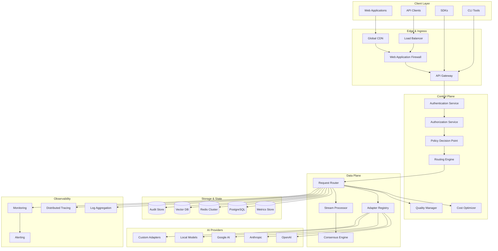

### Microservices Architecture

The platform follows a microservices architecture with clear separation of concerns:

#### Core Services

1. **API Gateway Service**
   - Request routing and load balancing
   - Rate limiting and throttling
   - API versioning and documentation
   - Request/response transformation

2. **Authentication & Authorization Service**
   - OIDC/SAML integration
   - JWT token management
   - Multi-factor authentication
   - Session management

3. **Policy Decision Point (PDP)**
   - ABAC policy evaluation
   - Data classification enforcement
   - Compliance rule validation
   - Real-time policy updates

4. **Routing Engine**
   - Intelligent model selection
   - Multi-armed bandit optimization
   - Load balancing across providers
   - Failover and circuit breaking

5. **Cost Optimization Service**
   - Real-time pricing monitoring
   - Cost prediction and budgeting
   - Savings calculation and reporting
   - Budget enforcement

6. **Quality Management Service**
   - Response quality scoring
   - Consensus algorithm execution
   - Model performance tracking
   - Champion/challenger testing

7. **Adapter Registry Service**
   - Provider integration management
   - Capability discovery
   - Health monitoring
   - Version management

#### Supporting Services

8. **Audit & Compliance Service**
   - Immutable audit logging
   - Hash chain maintenance
   - Compliance reporting
   - Data lineage tracking

9. **Privacy & Redaction Service**
   - PII detection and redaction
   - Differential privacy budgets
   - Data residency enforcement
   - Retention policy execution

10. **Observability Service**
    - Metrics collection and aggregation
    - Distributed tracing
    - Log aggregation and analysis
    - Alerting and notification

11. **Federation Coordinator**
    - Multi-region synchronization
    - State replication
    - Conflict resolution
    - Disaster recovery coordination

## Components and Interfaces

### Request Processing Pipeline

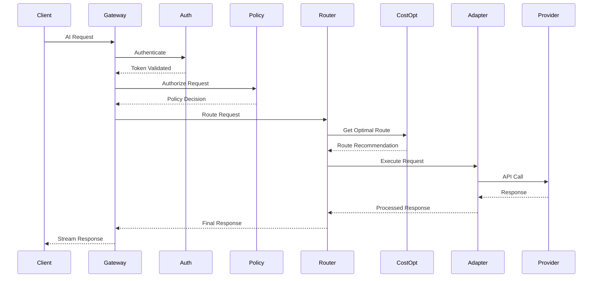

### Core Interfaces

#### 1. Request Router Interface

```typescript
interface RequestRouter {
  // Route a request to optimal provider
  route(request: AIRequest, context: RequestContext): Promise<RouteDecision>
  
  // Stream processing for real-time responses
  streamRoute(request: AIRequest, context: RequestContext): AsyncIterator<ResponseChunk>
  
  // Get routing recommendations
  getRecommendations(request: AIRequest): Promise<RouteRecommendation[]>
  
  // Update routing weights based on feedback
  updateWeights(feedback: RoutingFeedback): Promise<void>
}

interface AIRequest {
  prompt: string
  quality: 'fast' | 'balanced' | 'high'
  maxCostUSD: number
  latencySLO: number
  tenant: string
  context?: RequestContext
}

interface RouteDecision {
  providerId: string
  modelId: string
  estimatedCost: number
  estimatedLatency: number
  confidence: number
  reasoning: string[]
}
```

#### 2. Cost Optimization Interface

```typescript
interface CostOptimizer {
  // Get current pricing for all providers
  getCurrentPricing(): Promise<PricingMatrix>
  
  // Calculate optimal route based on cost/quality tradeoffs
  optimizeRoute(request: AIRequest, candidates: Provider[]): Promise<OptimizationResult>
  
  // Monitor and update pricing in real-time
  monitorPricing(): Promise<void>
  
  // Validate cost estimates against actual usage
  validateCosts(usage: UsageRecord[]): Promise<CostValidationResult>
}

interface PricingMatrix {
  providers: Record<string, ProviderPricing>
  lastUpdated: Date
  stalenessThreshold: number
}

interface ProviderPricing {
  inputTokenCost: number
  outputTokenCost: number
  requestCost?: number
  minimumCost?: number
  currency: string
  effectiveDate: Date
}
```

#### 3. Adapter Registry Interface

```typescript
interface AdapterRegistry {
  // Register new adapter
  registerAdapter(adapter: AdapterDefinition): Promise<string>
  
  // Discover adapter capabilities
  discoverCapabilities(adapterId: string): Promise<AdapterCapabilities>
  
  // Health check for adapters
  healthCheck(adapterId: string): Promise<HealthStatus>
  
  // Get available adapters for request
  getCompatibleAdapters(request: AIRequest): Promise<AdapterInfo[]>
}

interface AdapterDefinition {
  id: string
  name: string
  version: string
  provider: string
  models: ModelInfo[]
  capabilities: string[]
  pricing: PricingInfo
  healthEndpoint: string
  securityProfile: SecurityProfile
}
```

#### 4. Policy Engine Interface

```typescript
interface PolicyEngine {
  // Evaluate request against policies
  evaluate(request: AIRequest, context: RequestContext): Promise<PolicyDecision>
  
  // Update policies in real-time
  updatePolicy(policy: Policy): Promise<void>
  
  // Validate policy compliance
  validateCompliance(request: AIRequest, response: AIResponse): Promise<ComplianceResult>
  
  // Get applicable policies for context
  getPolicies(context: RequestContext): Promise<Policy[]>
}

interface Policy {
  id: string
  name: string
  rules: PolicyRule[]
  scope: PolicyScope
  priority: number
  enabled: boolean
}

interface PolicyDecision {
  allowed: boolean
  reason: string
  requiredRedactions: string[]
  dataClassification: string
  retentionPeriod: number
}
```

### Security Architecture

#### Zero-Trust Security Model

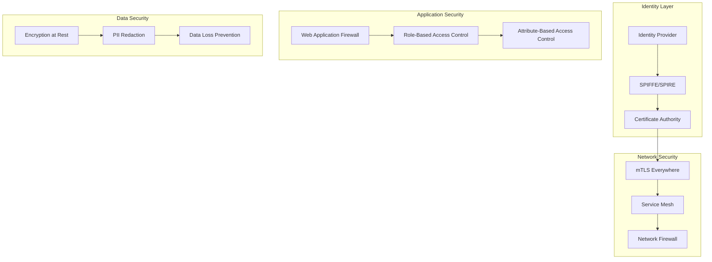

#### Security Controls Implementation

1. **Identity and Access Management**
   - SPIFFE/SPIRE for service identity
   - OIDC integration for user authentication
   - Attribute-based access control (ABAC)
   - Just-in-time access provisioning

2. **Network Security**
   - mTLS for all service-to-service communication
   - Service mesh with Istio/Linkerd
   - Network segmentation and micro-segmentation
   - Ingress/egress traffic filtering

3. **Application Security**
   - Web Application Firewall (WAF) with OWASP rules
   - Input validation and sanitization
   - Output encoding and escaping
   - Secure coding practices enforcement

4. **Data Protection**
   - Encryption at rest and in transit
   - PII detection and redaction
   - Data classification and labeling
   - Data loss prevention (DLP)

## Data Models

### Core Data Entities

#### 1. Request Entity

```sql
CREATE TABLE requests (
    id UUID PRIMARY KEY,
    tenant_id VARCHAR(100) NOT NULL,
    user_id VARCHAR(100),
    prompt_hash VARCHAR(64) NOT NULL,
    quality_tier VARCHAR(20) NOT NULL,
    max_cost_usd DECIMAL(10,6) NOT NULL,
    latency_slo_ms INTEGER NOT NULL,
    created_at TIMESTAMP WITH TIME ZONE DEFAULT NOW(),
    completed_at TIMESTAMP WITH TIME ZONE,
    status VARCHAR(20) NOT NULL DEFAULT 'pending',
    
    -- Routing information
    selected_provider VARCHAR(100),
    selected_model VARCHAR(100),
    route_reasoning JSONB,
    
    -- Cost and performance
    actual_cost_usd DECIMAL(10,6),
    actual_latency_ms INTEGER,
    tokens_input INTEGER,
    tokens_output INTEGER,
    
    -- Quality metrics
    quality_score DECIMAL(3,2),
    user_rating INTEGER,
    
    -- Compliance
    data_classification VARCHAR(50),
    redactions_applied JSONB,
    retention_until TIMESTAMP WITH TIME ZONE,
    
    INDEX idx_tenant_created (tenant_id, created_at),
    INDEX idx_status_created (status, created_at),
    INDEX idx_provider_model (selected_provider, selected_model)
);
```

#### 2. Provider Entity

```sql
CREATE TABLE providers (
    id VARCHAR(100) PRIMARY KEY,
    name VARCHAR(200) NOT NULL,
    type VARCHAR(50) NOT NULL, -- 'api', 'local', 'custom'
    base_url VARCHAR(500),
    api_version VARCHAR(20),
    
    -- Authentication
    auth_type VARCHAR(50), -- 'api_key', 'oauth', 'mtls'
    auth_config JSONB,
    
    -- Capabilities
    supported_models JSONB NOT NULL,
    max_tokens INTEGER,
    supports_streaming BOOLEAN DEFAULT false,
    supports_functions BOOLEAN DEFAULT false,
    
    -- Pricing
    pricing_model VARCHAR(50), -- 'per_token', 'per_request', 'per_minute'
    pricing_config JSONB NOT NULL,
    pricing_last_updated TIMESTAMP WITH TIME ZONE,
    
    -- Health and performance
    health_status VARCHAR(20) DEFAULT 'unknown',
    last_health_check TIMESTAMP WITH TIME ZONE,
    avg_latency_ms INTEGER,
    error_rate DECIMAL(5,4),
    
    -- Metadata
    created_at TIMESTAMP WITH TIME ZONE DEFAULT NOW(),
    updated_at TIMESTAMP WITH TIME ZONE DEFAULT NOW(),
    enabled BOOLEAN DEFAULT true
);
```

#### 3. Policy Entity

```sql
CREATE TABLE policies (
    id UUID PRIMARY KEY,
    name VARCHAR(200) NOT NULL,
    description TEXT,
    
    -- Scope
    tenant_id VARCHAR(100),
    user_groups JSONB,
    data_classifications JSONB,
    
    -- Rules
    rules JSONB NOT NULL,
    conditions JSONB,
    actions JSONB NOT NULL,
    
    -- Metadata
    priority INTEGER DEFAULT 100,
    enabled BOOLEAN DEFAULT true,
    created_at TIMESTAMP WITH TIME ZONE DEFAULT NOW(),
    updated_at TIMESTAMP WITH TIME ZONE DEFAULT NOW(),
    created_by VARCHAR(100),
    
    INDEX idx_tenant_enabled (tenant_id, enabled),
    INDEX idx_priority_enabled (priority, enabled)
);
```

#### 4. Audit Log Entity

```sql
CREATE TABLE audit_logs (
    id UUID PRIMARY KEY,
    event_type VARCHAR(100) NOT NULL,
    timestamp TIMESTAMP WITH TIME ZONE DEFAULT NOW(),
    
    -- Context
    tenant_id VARCHAR(100),
    user_id VARCHAR(100),
    session_id VARCHAR(100),
    request_id UUID,
    
    -- Event details
    resource_type VARCHAR(100),
    resource_id VARCHAR(200),
    action VARCHAR(100) NOT NULL,
    outcome VARCHAR(20) NOT NULL, -- 'success', 'failure', 'denied'
    
    -- Data
    event_data JSONB,
    before_state JSONB,
    after_state JSONB,
    
    -- Integrity
    hash_chain_prev VARCHAR(64),
    hash_chain_current VARCHAR(64) NOT NULL,
    signature VARCHAR(256),
    
    -- Compliance
    data_classification VARCHAR(50),
    retention_until TIMESTAMP WITH TIME ZONE,
    
    INDEX idx_tenant_timestamp (tenant_id, timestamp),
    INDEX idx_event_type_timestamp (event_type, timestamp),
    INDEX idx_hash_chain (hash_chain_current)
);
```

### Caching Strategy

#### Multi-Level Caching Architecture

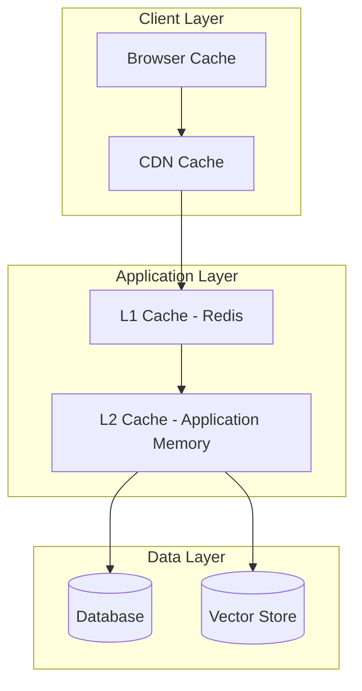

#### Cache Configuration

1. **Response Cache (L1 - Redis)**
   - TTL: 1-24 hours based on content type
   - Key: hash(prompt + quality + tenant + model)
   - Invalidation: On model updates or policy changes

2. **Routing Cache (L2 - Application Memory)**
   - TTL: 5-15 minutes
   - Key: hash(request_pattern + tenant + time_window)
   - Invalidation: On provider health changes

3. **Policy Cache (L2 - Application Memory)**
   - TTL: 1-5 minutes
   - Key: tenant_id + user_groups + data_classification
   - Invalidation: On policy updates

4. **Pricing Cache (L1 - Redis)**
   - TTL: 1-60 minutes based on provider
   - Key: provider_id + model_id + timestamp
   - Invalidation: On pricing API updates

## Error Handling

### Error Classification and Response Strategy

#### Error Categories

1. **Client Errors (4xx)**
   - Authentication failures
   - Authorization denials
   - Invalid request format
   - Rate limit exceeded
   - Budget exceeded

2. **Server Errors (5xx)**
   - Provider unavailable
   - Internal service failures
   - Database connectivity issues
   - Timeout errors

3. **Provider Errors**
   - Model unavailable
   - API rate limits
   - Content policy violations
   - Insufficient credits

#### Error Response Format

```typescript
interface ErrorResponse {
  error: {
    code: string
    message: string
    details?: Record<string, any>
    retryable: boolean
    retryAfter?: number
    correlationId: string
    timestamp: string
  }
  request: {
    id: string
    tenant: string
  }
}
```

#### Circuit Breaker Pattern

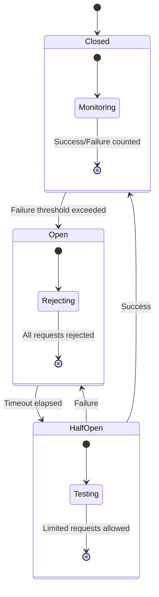

#### Retry Strategy

1. **Exponential Backoff**
   - Initial delay: 100ms
   - Maximum delay: 30 seconds
   - Backoff multiplier: 2.0
   - Jitter: ±25%

2. **Retry Conditions**
   - Network timeouts
   - 5xx server errors
   - Provider rate limits (with backoff)
   - Temporary provider unavailability

3. **Non-Retryable Errors**
   - Authentication failures
   - Authorization denials
   - Invalid request format
   - Content policy violations

## Testing Strategy

### Testing Pyramid

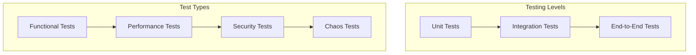

#### Unit Testing (70% of tests)

- **Coverage Target**: 90% code coverage
- **Framework**: Jest/Vitest for TypeScript, pytest for Python
- **Focus Areas**:
  - Business logic validation
  - Algorithm correctness
  - Error handling
  - Edge cases

#### Integration Testing (20% of tests)

- **Framework**: Testcontainers for database/Redis testing
- **Focus Areas**:
  - Service-to-service communication
  - Database operations
  - External API integrations
  - Message queue processing

#### End-to-End Testing (10% of tests)

- **Framework**: Playwright/Cypress for web UI, REST Assured for APIs
- **Focus Areas**:
  - Complete user workflows
  - Cross-service functionality
  - Performance under load
  - Disaster recovery scenarios

#### Performance Testing

1. **Load Testing**
   - Target: 10,000 concurrent requests
   - Duration: 30 minutes sustained load
   - Metrics: Latency p95 < 200ms, throughput > 50,000 req/min

2. **Stress Testing**
   - Gradual load increase until failure
   - Identify breaking points
   - Validate graceful degradation

3. **Chaos Engineering**
   - Random service failures
   - Network partitions
   - Database failovers
   - Provider outages

#### Security Testing

1. **Static Analysis**
   - SAST tools (SonarQube, Checkmarx)
   - Dependency vulnerability scanning
   - Infrastructure as Code scanning

2. **Dynamic Analysis**
   - DAST tools (OWASP ZAP, Burp Suite)
   - Penetration testing
   - API security testing

3. **Compliance Testing**
   - GDPR compliance validation
   - SOC 2 control testing
   - Industry-specific compliance checks

### Continuous Integration Pipeline

```mermaid
graph LR
    COMMIT[Code Commit] --> BUILD[Build & Test]
    BUILD --> SCAN[Security Scan]
    SCAN --> DEPLOY_DEV[Deploy to Dev]
    DEPLOY_DEV --> INT_TEST[Integration Tests]
    INT_TEST --> DEPLOY_STAGE[Deploy to Staging]
    DEPLOY_STAGE --> E2E_TEST[E2E Tests]
    E2E_TEST --> PERF_TEST[Performance Tests]
    PERF_TEST --> DEPLOY_PROD[Deploy to Production]
    DEPLOY_PROD --> MONITOR[Monitor & Alert]
```

#### Pipeline Stages

1. **Build & Unit Test** (2-5 minutes)
   - Code compilation
   - Unit test execution
   - Code coverage validation
   - Linting and formatting

2. **Security Scanning** (5-10 minutes)
   - SAST analysis
   - Dependency vulnerability check
   - Container image scanning
   - Infrastructure security validation

3. **Integration Testing** (10-15 minutes)
   - Service integration tests
   - Database migration tests
   - API contract validation
   - Message queue integration

4. **Performance Testing** (15-30 minutes)
   - Load testing on staging
   - Performance regression detection
   - Resource utilization validation
   - Scalability testing

5. **Deployment** (5-10 minutes)
   - Blue-green deployment
   - Health check validation
   - Rollback capability
   - Monitoring activation

### Quality Gates

#### Code Quality Gates

- **Code Coverage**: Minimum 85% for new code
- **Complexity**: Cyclomatic complexity < 10
- **Duplication**: < 3% code duplication
- **Security**: Zero critical/high vulnerabilities

#### Performance Gates

- **Latency**: p95 < 200ms for API responses
- **Throughput**: > 10,000 requests/minute
- **Error Rate**: < 0.1% for production traffic
- **Availability**: > 99.9% uptime SLA

#### Security Gates

- **Vulnerability Scanning**: Zero critical, < 5 high severity
- **Compliance**: 100% policy compliance
- **Access Control**: All endpoints protected
- **Data Protection**: PII redaction validated

## High Availability and Global Deployment Architecture

### Multi-Region Active-Active Architecture

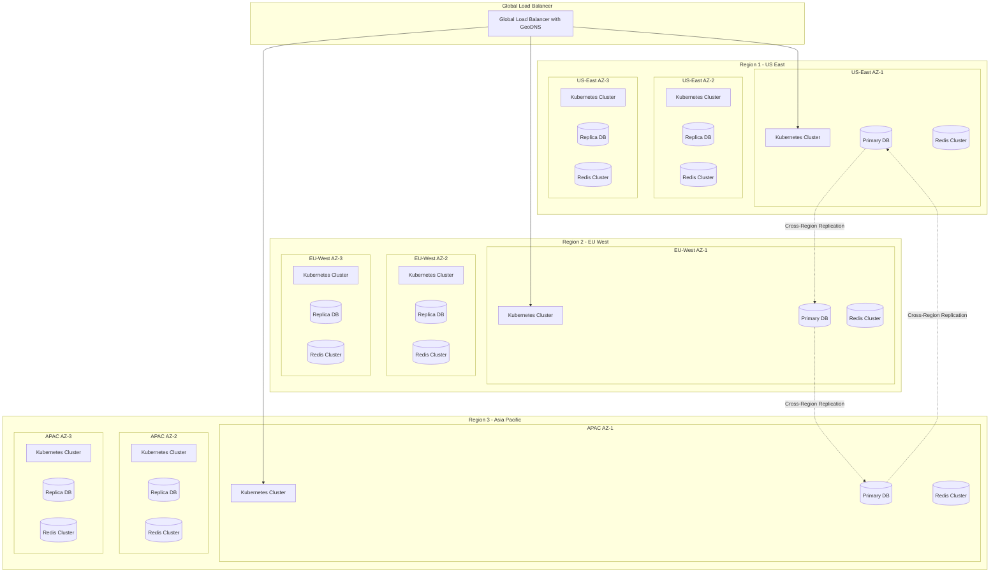

### High Availability Design Principles

#### 1. No Single Points of Failure
- **Load Balancers**: Multiple layers with health checks
- **Databases**: Multi-master with automatic failover
- **Caching**: Distributed Redis clusters with sharding
- **Services**: Minimum 3 replicas per service per AZ

#### 2. Automatic Failover Mechanisms
- **Database Failover**: < 30 seconds RTO with automated promotion
- **Service Failover**: Kubernetes liveness/readiness probes with < 10 second detection
- **Cross-Region Failover**: DNS-based with < 60 second TTL
- **Cache Failover**: Redis Sentinel with automatic master election

#### 3. Data Consistency and Replication
- **Synchronous Replication**: Within region for critical data
- **Asynchronous Replication**: Cross-region for disaster recovery
- **Conflict Resolution**: Last-writer-wins with vector clocks
- **Eventual Consistency**: Acceptable for non-critical data with < 5 second convergence

### Google Cloud Platform Deployment Architecture

#### GCP Service Selection Strategy

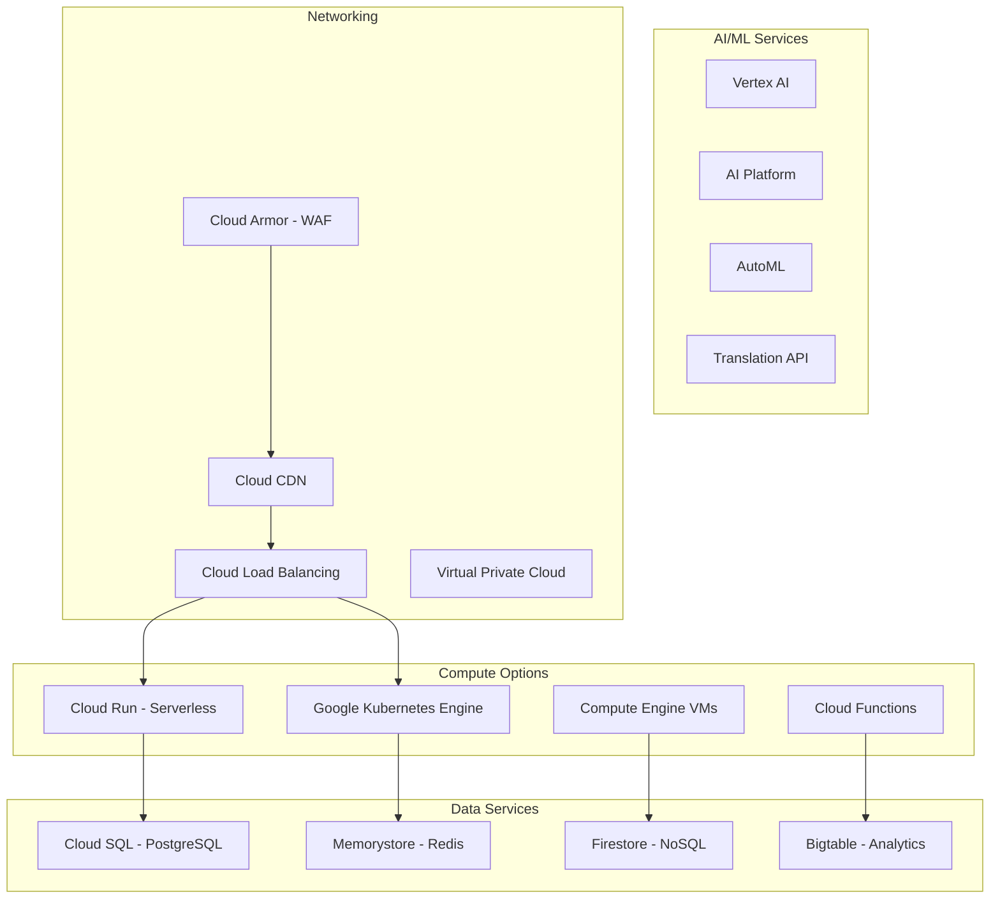

#### Deployment Option 1: Cloud Run Serverless Architecture

**Recommended for**: Development, staging, and small-to-medium production workloads

```yaml
# Cloud Run Configuration
apiVersion: serving.knative.dev/v1
kind: Service
metadata:
  name: atp-router
  annotations:
    run.googleapis.com/ingress: all
    run.googleapis.com/execution-environment: gen2
spec:
  template:
    metadata:
      annotations:
        autoscaling.knative.dev/minScale: "1"
        autoscaling.knative.dev/maxScale: "1000"
        run.googleapis.com/cpu-throttling: "false"
        run.googleapis.com/memory: "2Gi"
        run.googleapis.com/cpu: "2"
    spec:
      containerConcurrency: 1000
      timeoutSeconds: 300
      containers:
      - image: gcr.io/PROJECT_ID/atp-router:latest
        ports:
        - containerPort: 8080
        env:
        - name: DATABASE_URL
          valueFrom:
            secretKeyRef:
              name: database-secret
              key: url
        - name: REDIS_URL
          valueFrom:
            secretKeyRef:
              name: redis-secret
              key: url
        resources:
          limits:
            cpu: "2"
            memory: "2Gi"
```

**Cloud Run Benefits:**
- Zero server management
- Automatic scaling to zero
- Pay-per-request pricing
- Built-in load balancing
- Integrated with Cloud IAM
- Automatic HTTPS certificates

**Cloud Run Architecture:**

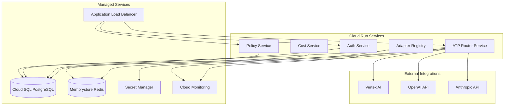

#### Deployment Option 2: Google Kubernetes Engine (GKE)

**Recommended for**: Large-scale production workloads requiring fine-grained control

```yaml
# GKE Cluster Configuration
apiVersion: container.v1
kind: Cluster
metadata:
  name: atp-production-cluster
spec:
  location: us-central1
  initialNodeCount: 3
  nodeConfig:
    machineType: e2-standard-4
    diskSizeGb: 100
    oauthScopes:
    - https://www.googleapis.com/auth/cloud-platform
  addonsConfig:
    istioConfig:
      disabled: false
    networkPolicyConfig:
      disabled: false
  networkPolicy:
    enabled: true
  ipAllocationPolicy:
    useIpAliases: true
  workloadIdentityConfig:
    workloadPool: PROJECT_ID.svc.id.goog
```

**GKE Deployment Manifest:**

```yaml
apiVersion: apps/v1
kind: Deployment
metadata:
  name: atp-router
  namespace: atp-system
spec:
  replicas: 3
  selector:
    matchLabels:
      app: atp-router
  template:
    metadata:
      labels:
        app: atp-router
    spec:
      serviceAccountName: atp-router-sa
      containers:
      - name: atp-router
        image: gcr.io/PROJECT_ID/atp-router:latest
        ports:
        - containerPort: 8080
        env:
        - name: DATABASE_URL
          valueFrom:
            secretKeyRef:
              name: database-secret
              key: url
        resources:
          requests:
            cpu: 500m
            memory: 1Gi
          limits:
            cpu: 2
            memory: 4Gi
        livenessProbe:
          httpGet:
            path: /healthz
            port: 8080
          initialDelaySeconds: 30
          periodSeconds: 10
        readinessProbe:
          httpGet:
            path: /ready
            port: 8080
          initialDelaySeconds: 5
          periodSeconds: 5
```

**GKE Benefits:**
- Full Kubernetes API access
- Advanced networking with Istio service mesh
- Horizontal Pod Autoscaling (HPA)
- Vertical Pod Autoscaling (VPA)
- Node auto-provisioning
- Workload Identity for secure GCP service access

#### Deployment Option 3: Compute Engine VM-based Architecture

**Recommended for**: Legacy integration requirements or specific compliance needs

```yaml
# Compute Engine Instance Template
apiVersion: compute/v1
kind: InstanceTemplate
metadata:
  name: atp-router-template
spec:
  properties:
    machineType: e2-standard-4
    disks:
    - boot: true
      initializeParams:
        sourceImage: projects/ubuntu-os-cloud/global/images/family/ubuntu-2004-lts
        diskSizeGb: 50
        diskType: pd-ssd
    networkInterfaces:
    - network: projects/PROJECT_ID/global/networks/atp-vpc
      subnetwork: projects/PROJECT_ID/regions/us-central1/subnetworks/atp-subnet
    metadata:
      startup-script: |
        #!/bin/bash
        # Install Docker
        curl -fsSL https://get.docker.com -o get-docker.sh
        sh get-docker.sh
        
        # Install Docker Compose
        curl -L "https://github.com/docker/compose/releases/download/v2.20.0/docker-compose-$(uname -s)-$(uname -m)" -o /usr/local/bin/docker-compose
        chmod +x /usr/local/bin/docker-compose
        
        # Deploy ATP services
        cd /opt/atp
        docker-compose up -d
    serviceAccounts:
    - email: atp-compute@PROJECT_ID.iam.gserviceaccount.com
      scopes:
      - https://www.googleapis.com/auth/cloud-platform
```

**VM-based Architecture:**

```mermaid
graph TB
    subgraph "Managed Instance Group"
        VM1[VM Instance 1]
        VM2[VM Instance 2]
        VM3[VM Instance 3]
    end

    subgraph "Load Balancing"
        HTTPLB[HTTP(S) Load Balancer]
        HEALTHCHECK[Health Check]
    end

    subgraph "Data Layer"
        CLOUDSQL[(Cloud SQL)]
        MEMORYSTORE[(Memorystore)]
        PERSISTENT[(Persistent Disks)]
    end

    HTTPLB --> VM1
    HTTPLB --> VM2
    HTTPLB --> VM3
    
    HEALTHCHECK --> VM1
    HEALTHCHECK --> VM2
    HEALTHCHECK --> VM3
    
    VM1 --> CLOUDSQL
    VM2 --> CLOUDSQL
    VM3 --> CLOUDSQL
    
    VM1 --> MEMORYSTORE
    VM2 --> MEMORYSTORE
    VM3 --> MEMORYSTORE
```

#### Deployment Option 4: Hybrid Cloud Functions + Cloud Run

**Recommended for**: Event-driven workloads with mixed synchronous/asynchronous processing

```yaml
# Cloud Function for Event Processing
apiVersion: cloudfunctions/v1
kind: CloudFunction
metadata:
  name: atp-event-processor
spec:
  sourceArchiveUrl: gs://PROJECT_ID-functions/atp-events.zip
  entryPoint: processEvent
  runtime: python39
  trigger:
    eventTrigger:
      eventType: providers/cloud.pubsub/eventTypes/topic.publish
      resource: projects/PROJECT_ID/topics/atp-events
  environmentVariables:
    DATABASE_URL: 
      secretKeyRef:
        name: database-secret
        key: url
```

**Hybrid Architecture Benefits:**
- Cost optimization through appropriate service selection
- Event-driven scaling for background tasks
- Synchronous processing for real-time requests
- Simplified operations with managed services

#### Regional Distribution on GCP

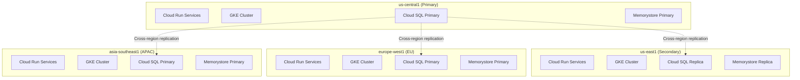

#### Open Source Model Integration Architecture

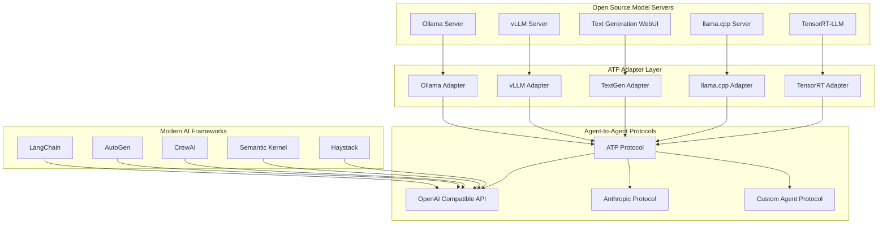

#### 1. Ollama Integration

**Ollama Adapter Configuration:**
```yaml
# Ollama adapter configuration
apiVersion: v1
kind: ConfigMap
metadata:
  name: ollama-adapter-config
data:
  config.yaml: |
    adapter:
      id: ollama-local
      name: "Ollama Local Models"
      type: ollama
      version: "1.0.0"
    
    connection:
      base_url: "http://ollama:11434"
      timeout: 30s
      retry_attempts: 3
    
    models:
      - name: "llama2:7b"
        context_length: 4096
        cost_per_token: 0.0  # Free for local deployment
        capabilities: ["text-generation", "chat"]
      - name: "codellama:13b"
        context_length: 16384
        cost_per_token: 0.0
        capabilities: ["code-generation", "text-generation"]
      - name: "mistral:7b"
        context_length: 8192
        cost_per_token: 0.0
        capabilities: ["text-generation", "chat", "instruct"]
    
    health_check:
      endpoint: "/api/tags"
      interval: 30s
      timeout: 5s
```

**Ollama Adapter Implementation:**
```python
from typing import AsyncIterator, Dict, Any
import aiohttp
import json

class OllamaAdapter:
    def __init__(self, config: Dict[str, Any]):
        self.base_url = config["connection"]["base_url"]
        self.timeout = config["connection"]["timeout"]
        self.models = {m["name"]: m for m in config["models"]}
    
    async def get_capabilities(self) -> Dict[str, Any]:
        """Discover available models from Ollama server"""
        async with aiohttp.ClientSession() as session:
            async with session.get(f"{self.base_url}/api/tags") as response:
                data = await response.json()
                return {
                    "models": [model["name"] for model in data.get("models", [])],
                    "capabilities": ["text-generation", "chat", "embedding"],
                    "max_context": max(m.get("context_length", 4096) for m in self.models.values()),
                    "cost_per_token": 0.0  # Local deployment
                }
    
    async def estimate_cost(self, prompt: str, model: str) -> Dict[str, Any]:
        """Estimate cost for Ollama request (always 0 for local)"""
        token_count = len(prompt.split()) * 1.3  # Rough estimation
        return {
            "input_tokens": int(token_count),
            "output_tokens": int(token_count * 0.5),  # Estimated
            "total_cost": 0.0,
            "currency": "USD"
        }
    
    async def stream_completion(self, prompt: str, model: str, **kwargs) -> AsyncIterator[Dict[str, Any]]:
        """Stream completion from Ollama"""
        payload = {
            "model": model,
            "prompt": prompt,
            "stream": True,
            **kwargs
        }
        
        async with aiohttp.ClientSession() as session:
            async with session.post(
                f"{self.base_url}/api/generate",
                json=payload,
                timeout=aiohttp.ClientTimeout(total=self.timeout)
            ) as response:
                async for line in response.content:
                    if line:
                        data = json.loads(line.decode())
                        yield {
                            "type": "chunk",
                            "content": data.get("response", ""),
                            "done": data.get("done", False),
                            "model": model,
                            "tokens": data.get("eval_count", 0)
                        }
```

#### 2. vLLM Integration

**vLLM Adapter Configuration:**
```yaml
# vLLM adapter configuration
apiVersion: v1
kind: ConfigMap
metadata:
  name: vllm-adapter-config
data:
  config.yaml: |
    adapter:
      id: vllm-local
      name: "vLLM High-Performance Server"
      type: vllm
      version: "1.0.0"
    
    connection:
      base_url: "http://vllm-server:8000"
      api_key: "${VLLM_API_KEY}"
      timeout: 60s
    
    models:
      - name: "meta-llama/Llama-2-7b-chat-hf"
        max_tokens: 4096
        cost_per_token: 0.0
        tensor_parallel_size: 1
        gpu_memory_utilization: 0.9
      - name: "meta-llama/Llama-2-13b-chat-hf"
        max_tokens: 4096
        cost_per_token: 0.0
        tensor_parallel_size: 2
        gpu_memory_utilization: 0.9
    
    performance:
      max_batch_size: 256
      max_concurrent_requests: 1000
      enable_chunked_prefill: true
```

**vLLM Adapter Implementation:**
```python
class VLLMAdapter:
    def __init__(self, config: Dict[str, Any]):
        self.base_url = config["connection"]["base_url"]
        self.api_key = config["connection"].get("api_key")
        self.models = {m["name"]: m for m in config["models"]}
    
    async def stream_completion(self, prompt: str, model: str, **kwargs) -> AsyncIterator[Dict[str, Any]]:
        """Stream completion using vLLM OpenAI-compatible API"""
        headers = {"Authorization": f"Bearer {self.api_key}"} if self.api_key else {}
        
        payload = {
            "model": model,
            "messages": [{"role": "user", "content": prompt}],
            "stream": True,
            "max_tokens": kwargs.get("max_tokens", 1024),
            "temperature": kwargs.get("temperature", 0.7)
        }
        
        async with aiohttp.ClientSession() as session:
            async with session.post(
                f"{self.base_url}/v1/chat/completions",
                json=payload,
                headers=headers
            ) as response:
                async for line in response.content:
                    if line.startswith(b"data: "):
                        data_str = line[6:].decode().strip()
                        if data_str == "[DONE]":
                            break
                        
                        data = json.loads(data_str)
                        choice = data["choices"][0]
                        if "delta" in choice and "content" in choice["delta"]:
                            yield {
                                "type": "chunk",
                                "content": choice["delta"]["content"],
                                "model": model,
                                "finish_reason": choice.get("finish_reason")
                            }
```

#### 3. Modern AI Framework Integration

**LangChain Integration:**
```python
from langchain.llms.base import LLM
from langchain.callbacks.manager import CallbackManagerForLLMRun
from typing import Optional, List, Any

class ATPLangChainLLM(LLM):
    """LangChain integration for ATP platform"""
    
    atp_client: Any
    model_name: str = "default"
    
    @property
    def _llm_type(self) -> str:
        return "atp"
    
    def _call(
        self,
        prompt: str,
        stop: Optional[List[str]] = None,
        run_manager: Optional[CallbackManagerForLLMRun] = None,
        **kwargs: Any,
    ) -> str:
        """Call ATP platform for completion"""
        response = self.atp_client.complete(
            prompt=prompt,
            model=self.model_name,
            stop=stop,
            **kwargs
        )
        return response.text
    
    async def _acall(
        self,
        prompt: str,
        stop: Optional[List[str]] = None,
        run_manager: Optional[CallbackManagerForLLMRun] = None,
        **kwargs: Any,
    ) -> str:
        """Async call ATP platform"""
        response = await self.atp_client.acomplete(
            prompt=prompt,
            model=self.model_name,
            stop=stop,
            **kwargs
        )
        return response.text

# Usage example
from langchain.chains import LLMChain
from langchain.prompts import PromptTemplate

atp_llm = ATPLangChainLLM(atp_client=atp_client, model_name="llama2:7b")
prompt = PromptTemplate(template="Explain {concept} in simple terms", input_variables=["concept"])
chain = LLMChain(llm=atp_llm, prompt=prompt)

result = chain.run(concept="quantum computing")
```

**AutoGen Integration:**
```python
import autogen
from typing import Dict, Any, List

class ATPAutoGenAgent(autogen.ConversableAgent):
    """AutoGen agent using ATP platform"""
    
    def __init__(self, atp_client, model_name: str = "default", **kwargs):
        self.atp_client = atp_client
        self.model_name = model_name
        
        # Configure AutoGen agent
        super().__init__(
            llm_config={
                "config_list": [{
                    "model": model_name,
                    "api_type": "atp",
                    "base_url": atp_client.base_url,
                    "api_key": atp_client.api_key
                }]
            },
            **kwargs
        )
    
    def generate_reply(self, messages: List[Dict], sender, config) -> str:
        """Generate reply using ATP platform"""
        # Convert messages to prompt
        prompt = self._messages_to_prompt(messages)
        
        # Get response from ATP
        response = self.atp_client.complete(
            prompt=prompt,
            model=self.model_name,
            max_tokens=config.get("max_tokens", 1024)
        )
        
        return response.text

# Usage example
user_proxy = autogen.UserProxyAgent("user_proxy")
assistant = ATPAutoGenAgent(
    atp_client=atp_client,
    model_name="codellama:13b",
    name="coding_assistant"
)

user_proxy.initiate_chat(
    assistant,
    message="Write a Python function to calculate fibonacci numbers"
)
```

#### 4. Agent-to-Agent Protocol Design

**ATP Agent Protocol Specification:**
```typescript
interface AgentMessage {
  id: string
  type: 'request' | 'response' | 'event' | 'error'
  source: AgentIdentity
  target: AgentIdentity
  timestamp: string
  payload: any
  metadata?: Record<string, any>
}

interface AgentIdentity {
  id: string
  name: string
  version: string
  capabilities: string[]
  endpoint: string
}

interface AgentCapability {
  name: string
  description: string
  inputSchema: JSONSchema
  outputSchema: JSONSchema
  cost: CostModel
  performance: PerformanceMetrics
}
```

**Multi-Agent Orchestration:**
```python
class MultiAgentOrchestrator:
    """Orchestrate multiple agents for complex tasks"""
    
    def __init__(self, atp_client):
        self.atp_client = atp_client
        self.agents = {}
        self.workflows = {}
    
    async def register_agent(self, agent_config: Dict[str, Any]):
        """Register a new agent in the system"""
        agent_id = agent_config["id"]
        self.agents[agent_id] = {
            "config": agent_config,
            "capabilities": await self._discover_capabilities(agent_id),
            "health": "unknown",
            "last_seen": None
        }
    
    async def execute_workflow(self, workflow_id: str, input_data: Any) -> Any:
        """Execute a multi-agent workflow"""
        workflow = self.workflows[workflow_id]
        context = {"input": input_data, "results": {}}
        
        for step in workflow["steps"]:
            agent_id = step["agent"]
            task = step["task"]
            
            # Route task to appropriate agent
            result = await self.atp_client.route_request(
                agent_id=agent_id,
                task=task,
                context=context,
                quality=step.get("quality", "balanced")
            )
            
            context["results"][step["id"]] = result
        
        return context["results"]
    
    async def _discover_capabilities(self, agent_id: str) -> List[str]:
        """Discover agent capabilities"""
        response = await self.atp_client.get_agent_info(agent_id)
        return response.get("capabilities", [])
```

#### 5. Cost-Effective Model Selection Strategy

**Intelligent Model Selection Algorithm:**
```python
class CostEffectiveModelSelector:
    """Select most cost-effective model for given requirements"""
    
    def __init__(self):
        self.model_registry = {}
        self.performance_history = {}
    
    def register_model(self, model_info: Dict[str, Any]):
        """Register model with cost and performance characteristics"""
        self.model_registry[model_info["id"]] = {
            "name": model_info["name"],
            "type": model_info["type"],  # "local", "cloud", "hybrid"
            "cost_per_token": model_info.get("cost_per_token", 0.0),
            "fixed_cost": model_info.get("fixed_cost", 0.0),
            "capabilities": model_info["capabilities"],
            "performance": model_info["performance"],
            "availability": model_info.get("availability", 1.0)
        }
    
    def select_optimal_model(
        self,
        requirements: Dict[str, Any],
        budget_constraint: float = None
    ) -> str:
        """Select optimal model based on requirements and budget"""
        
        # Filter models by capabilities
        compatible_models = [
            model_id for model_id, model in self.model_registry.items()
            if self._is_compatible(model, requirements)
        ]
        
        if not compatible_models:
            raise ValueError("No compatible models found")
        
        # Score models by cost-effectiveness
        scored_models = []
        for model_id in compatible_models:
            model = self.model_registry[model_id]
            score = self._calculate_cost_effectiveness_score(
                model, requirements, budget_constraint
            )
            scored_models.append((model_id, score))
        
        # Return best scoring model
        scored_models.sort(key=lambda x: x[1], reverse=True)
        return scored_models[0][0]
    
    def _calculate_cost_effectiveness_score(
        self,
        model: Dict[str, Any],
        requirements: Dict[str, Any],
        budget_constraint: float = None
    ) -> float:
        """Calculate cost-effectiveness score for model"""
        
        # Base score from performance metrics
        performance_score = model["performance"].get("quality", 0.5)
        latency_score = 1.0 / (model["performance"].get("latency_ms", 1000) / 1000)
        
        # Cost penalty
        estimated_tokens = requirements.get("estimated_tokens", 1000)
        estimated_cost = (
            model["cost_per_token"] * estimated_tokens + 
            model["fixed_cost"]
        )
        
        # Prefer local models for cost savings
        if model["type"] == "local":
            cost_score = 1.0  # Maximum score for free local models
        else:
            cost_score = 1.0 / (1.0 + estimated_cost)
        
        # Budget constraint penalty
        budget_penalty = 1.0
        if budget_constraint and estimated_cost > budget_constraint:
            budget_penalty = 0.1  # Heavy penalty for exceeding budget
        
        # Availability bonus
        availability_bonus = model["availability"]
        
        # Combined score
        total_score = (
            performance_score * 0.4 +
            latency_score * 0.2 +
            cost_score * 0.3 +
            availability_bonus * 0.1
        ) * budget_penalty
        
        return total_score
```

#### 6. Framework Compatibility Matrix

```yaml
# Framework compatibility configuration
compatibility_matrix:
  langchain:
    supported_versions: [">=0.1.0", "<2.0.0"]
    integration_type: "native"
    features:
      - llm_wrapper
      - chain_integration
      - agent_tools
      - memory_integration
  
  autogen:
    supported_versions: [">=0.2.0"]
    integration_type: "adapter"
    features:
      - conversable_agent
      - group_chat
      - code_execution
      - function_calling
  
  crewai:
    supported_versions: [">=0.1.0"]
    integration_type: "plugin"
    features:
      - crew_integration
      - task_delegation
      - role_based_agents
  
  semantic_kernel:
    supported_versions: [">=0.3.0"]
    integration_type: "connector"
    features:
      - skill_integration
      - planner_support
      - memory_connectors
  
  haystack:
    supported_versions: [">=1.15.0"]
    integration_type: "node"
    features:
      - pipeline_integration
      - document_processing
      - retrieval_augmentation
```

#### Cost Optimization Strategies for GCP

1. **Committed Use Discounts**
   - 1-year or 3-year commitments for predictable workloads
   - Up to 57% savings on Compute Engine
   - Up to 70% savings on Cloud SQL

2. **Preemptible/Spot Instances**
   - Use for batch processing and non-critical workloads
   - Up to 80% cost savings
   - Automatic failover to regular instances

3. **Sustained Use Discounts**
   - Automatic discounts for running instances
   - Up to 30% discount for sustained usage
   - No upfront commitment required

4. **Right-sizing Recommendations**
   - Use Cloud Monitoring recommendations
   - Automatic VM right-sizing
   - Custom machine types for optimal resource allocation

#### Deployment Characteristics per Region

1. **Primary Regions** (US East, EU West, APAC Southeast)
   - Full service deployment with all capabilities
   - Read/write database masters
   - Complete adapter registry
   - Full observability stack

2. **Secondary Regions** (US West, EU North, APAC Northeast)
   - Full service deployment for redundancy
   - Read replicas with failover capability
   - Cached adapter configurations
   - Regional observability aggregation

3. **Edge Regions** (Canada, Brazil, UK, Germany, Australia, India)
   - Core services only (routing, auth, basic adapters)
   - Read-only replicas
   - Local caching layers
   - Metrics forwarding to primary regions

### Proof of Concept (POC) Testing Framework

#### POC Test Categories

1. **Feature Validation POCs**
   - Each design component must have a working POC
   - POCs demonstrate core functionality
   - Integration between components validated
   - Performance characteristics measured

2. **High Availability POCs**
   - Failover scenario testing
   - Data consistency validation
   - Cross-region replication testing
   - Disaster recovery procedures

3. **Global Deployment POCs**
   - Multi-region deployment automation
   - Geographic routing validation
   - Latency optimization testing
   - Compliance boundary enforcement

#### POC Implementation Requirements

```typescript
interface POCTest {
  name: string
  description: string
  designComponent: string
  testScenarios: TestScenario[]
  successCriteria: SuccessCriteria
  automationLevel: 'manual' | 'semi-automated' | 'fully-automated'
  executionFrequency: 'on-demand' | 'daily' | 'weekly' | 'monthly'
}

interface TestScenario {
  scenario: string
  steps: string[]
  expectedOutcome: string
  validationMethod: string
  rollbackProcedure?: string
}

interface SuccessCriteria {
  functionalRequirements: string[]
  performanceRequirements: PerformanceMetric[]
  reliabilityRequirements: ReliabilityMetric[]
  securityRequirements: string[]
}
```

#### Example POC Tests

1. **Request Routing POC**
   ```yaml
   name: "Intelligent Request Routing"
   designComponent: "Routing Engine"
   testScenarios:
     - scenario: "Cost-optimized routing"
       steps:
         - "Send request with cost constraint"
         - "Verify cheapest compatible model selected"
         - "Validate cost calculation accuracy"
       expectedOutcome: "Request routed to lowest cost provider meeting quality requirements"
       validationMethod: "Cost comparison and response quality scoring"
   
   successCriteria:
     functionalRequirements:
       - "Routes to correct provider 100% of time"
       - "Cost calculations accurate within 5%"
     performanceRequirements:
       - metric: "routing_decision_latency"
         target: "< 50ms p95"
       - metric: "cost_optimization_accuracy"
         target: "> 95%"
   ```

2. **Multi-Region Failover POC**
   ```yaml
   name: "Cross-Region Disaster Recovery"
   designComponent: "Federation Coordinator"
   testScenarios:
     - scenario: "Primary region failure"
       steps:
         - "Simulate complete region outage"
         - "Verify automatic failover to secondary region"
         - "Validate data consistency after failover"
         - "Test failback when primary region recovers"
       expectedOutcome: "< 60 second RTO, < 15 minute RPO"
       validationMethod: "Automated monitoring and data integrity checks"
   ```

3. **Real-time Pricing POC**
   ```yaml
   name: "Dynamic Pricing Updates"
   designComponent: "Cost Optimization Service"
   testScenarios:
     - scenario: "Provider pricing change detection"
       steps:
         - "Mock pricing API change"
         - "Verify automatic detection and update"
         - "Validate routing decision changes"
         - "Test stale pricing alerts"
       expectedOutcome: "Pricing updates within 5 minutes, routing adjusts automatically"
       validationMethod: "Pricing API monitoring and routing decision logs"
   ```

#### POC Automation Pipeline

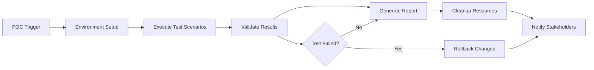

#### POC Test Infrastructure

1. **Dedicated POC Environment**
   - Isolated Kubernetes clusters per region
   - Synthetic data generation
   - Mock external services
   - Automated teardown after testing

2. **POC Test Orchestration**
   - GitOps-based test deployment
   - Parallel test execution
   - Real-time result monitoring
   - Automated rollback on failures

3. **POC Validation Framework**
   - Automated assertion checking
   - Performance benchmark comparison
   - Security compliance validation
   - Integration point verification

#### Continuous POC Testing

1. **Scheduled POC Runs**
   - Daily: Core functionality POCs
   - Weekly: Integration and performance POCs
   - Monthly: Full disaster recovery POCs
   - Quarterly: Complete system validation POCs

2. **Triggered POC Runs**
   - On code changes affecting tested components
   - Before production deployments
   - After infrastructure changes
   - During incident response validation

3. **POC Result Tracking**
   - Historical trend analysis
   - Regression detection
   - Performance degradation alerts
   - Compliance drift monitoring

## Administrative Interface Design

### Command Line Interface (CLI)

#### CLI Architecture and Commands

```bash
# ATP Enterprise CLI - atpctl
atpctl [global-options] <command> [command-options] [arguments]

# Global Options
--config-file PATH     # Configuration file path
--region REGION        # Target region for operations
--output FORMAT        # Output format: json, yaml, table, csv
--verbose             # Enable verbose logging
--dry-run             # Show what would be done without executing
```

#### Core CLI Command Groups

1. **Cluster Management**
   ```bash
   # Cluster operations
   atpctl cluster status                    # Show cluster health across regions
   atpctl cluster scale --replicas 5        # Scale services
   atpctl cluster failover --to-region eu-west  # Initiate failover
   atpctl cluster backup --type full        # Create cluster backup
   atpctl cluster restore --from backup-id  # Restore from backup
   
   # Node management
   atpctl nodes list                        # List all nodes
   atpctl nodes drain NODE_ID               # Drain node for maintenance
   atpctl nodes cordon NODE_ID              # Mark node as unschedulable
   ```

2. **Provider and Adapter Management**
   ```bash
   # Provider operations
   atpctl providers list                    # List all providers
   atpctl providers add --config provider.yaml  # Add new provider
   atpctl providers test PROVIDER_ID        # Test provider connectivity
   atpctl providers disable PROVIDER_ID    # Disable provider
   atpctl providers pricing update          # Update pricing information
   
   # Adapter management
   atpctl adapters list                     # List all adapters
   atpctl adapters deploy --file adapter.yaml  # Deploy new adapter
   atpctl adapters logs ADAPTER_ID          # View adapter logs
   atpctl adapters health-check ADAPTER_ID  # Check adapter health
   ```

3. **Policy and Compliance Management**
   ```bash
   # Policy operations
   atpctl policies list --tenant TENANT_ID # List policies
   atpctl policies create --file policy.yaml  # Create new policy
   atpctl policies validate --file policy.yaml  # Validate policy syntax
   atpctl policies test --request request.json  # Test policy against request
   atpctl policies audit --since 24h        # Show policy audit trail
   
   # Compliance operations
   atpctl compliance status                 # Show compliance status
   atpctl compliance report --type soc2     # Generate compliance report
   atpctl compliance scan --tenant TENANT_ID  # Run compliance scan
   ```

4. **Cost and Usage Analytics**
   ```bash
   # Cost management
   atpctl costs summary --period 30d        # Cost summary
   atpctl costs breakdown --by provider     # Cost breakdown
   atpctl costs forecast --days 30          # Cost forecast
   atpctl costs alerts list                 # List cost alerts
   atpctl costs budgets set --tenant TENANT --limit 1000  # Set budget
   
   # Usage analytics
   atpctl usage stats --tenant TENANT_ID   # Usage statistics
   atpctl usage trends --metric latency     # Usage trends
   atpctl usage top --by requests          # Top consumers
   ```

5. **Monitoring and Troubleshooting**
   ```bash
   # Monitoring
   atpctl monitor status                    # Overall system status
   atpctl monitor alerts                    # Active alerts
   atpctl monitor metrics --service routing # Service metrics
   atpctl monitor traces --request-id ID    # Trace specific request
   
   # Troubleshooting
   atpctl debug request REQUEST_ID          # Debug specific request
   atpctl debug logs --service routing --since 1h  # Service logs
   atpctl debug network --test connectivity # Network diagnostics
   atpctl debug performance --analyze       # Performance analysis
   ```

#### CLI Configuration and Authentication

```yaml
# ~/.atpctl/config.yaml
current-context: production
contexts:
  production:
    cluster: prod-us-east
    region: us-east-1
    auth:
      type: oidc
      oidc-issuer: https://auth.company.com
      client-id: atpctl
  staging:
    cluster: staging-us-east
    region: us-east-1
    auth:
      type: api-key
      api-key-file: ~/.atpctl/staging-key

clusters:
  prod-us-east:
    server: https://api.atp.company.com
    certificate-authority: ~/.atpctl/ca.crt
  staging-us-east:
    server: https://staging-api.atp.company.com
    insecure-skip-tls-verify: true
```

### Web-Based Administrative Interface

#### Dashboard Architecture

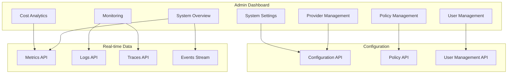

#### Key Dashboard Views

1. **System Overview Dashboard**
   ```typescript
   interface SystemOverview {
     // Real-time metrics
     requestsPerSecond: number
     averageLatency: number
     errorRate: number
     costPerHour: number
     
     // Health indicators
     systemHealth: 'healthy' | 'degraded' | 'critical'
     regionStatus: RegionStatus[]
     providerHealth: ProviderHealth[]
     
     // Recent activity
     recentAlerts: Alert[]
     recentDeployments: Deployment[]
     costTrends: CostTrend[]
   }
   ```

2. **Provider Management Interface**
   - Visual provider topology
   - Real-time health monitoring
   - Cost and performance metrics per provider
   - Configuration management with validation
   - A/B testing controls for new providers

3. **Policy Management Console**
   - Visual policy builder with drag-and-drop
   - Policy simulation and testing
   - Impact analysis for policy changes
   - Compliance mapping and validation
   - Audit trail visualization

4. **Cost Analytics Dashboard**
   - Interactive cost breakdown charts
   - Savings opportunity identification
   - Budget tracking and forecasting
   - Cost allocation by tenant/project
   - ROI analysis and recommendations

#### User Experience Design Principles

1. **Progressive Disclosure**
   - Start with high-level overview
   - Drill down into specific areas
   - Context-sensitive help and documentation
   - Guided workflows for complex tasks

2. **Real-time Feedback**
   - Live updating dashboards
   - Immediate validation feedback
   - Progress indicators for long-running operations
   - Toast notifications for important events

3. **Accessibility and Usability**
   - WCAG 2.1 AA compliance
   - Keyboard navigation support
   - High contrast mode
   - Responsive design for mobile devices

#### Administrative Workflows

1. **Provider Onboarding Workflow**
   ```mermaid
   graph LR
     START[Start] --> DISCOVER[Auto-discover Capabilities]
     DISCOVER --> VALIDATE[Validate Configuration]
     VALIDATE --> TEST[Run Connectivity Tests]
     TEST --> APPROVE[Admin Approval]
     APPROVE --> DEPLOY[Deploy to Production]
     DEPLOY --> MONITOR[Monitor Health]
   ```

2. **Incident Response Workflow**
   ```mermaid
   graph LR
     ALERT[Alert Triggered] --> ASSESS[Assess Impact]
     ASSESS --> MITIGATE[Auto-mitigation]
     MITIGATE --> ESCALATE[Manual Escalation]
     ESCALATE --> RESOLVE[Resolution]
     RESOLVE --> POSTMORTEM[Post-mortem]
   ```

3. **Policy Update Workflow**
   ```mermaid
   graph LR
     DRAFT[Draft Policy] --> VALIDATE[Validate Syntax]
     VALIDATE --> SIMULATE[Simulate Impact]
     SIMULATE --> REVIEW[Peer Review]
     REVIEW --> APPROVE[Approval]
     APPROVE --> DEPLOY[Gradual Rollout]
     DEPLOY --> MONITOR[Monitor Effects]
   ```

### Mobile Administrative App

#### Mobile App Features

1. **Critical Alerts and Notifications**
   - Push notifications for critical alerts
   - Quick acknowledgment and escalation
   - On-call rotation management
   - Emergency contact integration

2. **System Health Monitoring**
   - Key metrics dashboard
   - Regional status overview
   - Provider health indicators
   - Cost burn rate monitoring

3. **Emergency Response Actions**
   - Emergency provider disable/enable
   - Traffic routing controls
   - Maintenance mode activation
   - Incident communication tools

#### Mobile Interface Design

```typescript
interface MobileAdminApp {
  // Core screens
  dashboard: DashboardScreen
  alerts: AlertsScreen
  providers: ProvidersScreen
  incidents: IncidentsScreen
  
  // Emergency actions
  emergencyActions: EmergencyActionsScreen
  
  // Settings and profile
  settings: SettingsScreen
  profile: ProfileScreen
}

interface DashboardScreen {
  // Key metrics widgets
  systemHealth: HealthWidget
  requestMetrics: MetricsWidget
  costMetrics: CostWidget
  recentAlerts: AlertsWidget
  
  // Quick actions
  quickActions: QuickAction[]
}
```

### Administrative API Design

#### RESTful Admin API

```typescript
// Provider Management API
GET    /admin/v1/providers                    // List providers
POST   /admin/v1/providers                    // Create provider
GET    /admin/v1/providers/{id}               // Get provider details
PUT    /admin/v1/providers/{id}               // Update provider
DELETE /admin/v1/providers/{id}               // Delete provider
POST   /admin/v1/providers/{id}/test          // Test provider connectivity
POST   /admin/v1/providers/{id}/enable        // Enable provider
POST   /admin/v1/providers/{id}/disable       // Disable provider

// Policy Management API
GET    /admin/v1/policies                     // List policies
POST   /admin/v1/policies                     // Create policy
GET    /admin/v1/policies/{id}                // Get policy details
PUT    /admin/v1/policies/{id}                // Update policy
DELETE /admin/v1/policies/{id}                // Delete policy
POST   /admin/v1/policies/{id}/validate       // Validate policy
POST   /admin/v1/policies/{id}/simulate       // Simulate policy impact

// System Management API
GET    /admin/v1/system/status                // System status
GET    /admin/v1/system/health                // Health check
POST   /admin/v1/system/maintenance           // Enter maintenance mode
DELETE /admin/v1/system/maintenance           // Exit maintenance mode
GET    /admin/v1/system/metrics               // System metrics
GET    /admin/v1/system/logs                  // System logs
```

#### WebSocket Admin API for Real-time Updates

```typescript
interface AdminWebSocketAPI {
  // Subscribe to real-time updates
  subscribe(topics: string[]): void
  
  // Available topics
  topics: {
    'system.metrics': SystemMetrics
    'system.alerts': Alert[]
    'providers.health': ProviderHealth[]
    'costs.realtime': CostMetrics
    'requests.stream': RequestMetrics
  }
}
```

### Administrative Security and Access Control

#### Role-Based Access Control for Admins

```yaml
# Admin roles definition
roles:
  super-admin:
    permissions:
      - system:*
      - providers:*
      - policies:*
      - users:*
      - costs:*
    
  platform-admin:
    permissions:
      - system:read
      - system:maintenance
      - providers:*
      - policies:read
      - costs:read
    
  security-admin:
    permissions:
      - policies:*
      - users:*
      - audit:*
      - compliance:*
    
  cost-admin:
    permissions:
      - costs:*
      - budgets:*
      - billing:*
      - usage:read
    
  read-only-admin:
    permissions:
      - system:read
      - providers:read
      - policies:read
      - costs:read
      - users:read
```

#### Audit Trail for Administrative Actions

```typescript
interface AdminAuditLog {
  id: string
  timestamp: Date
  adminUserId: string
  action: string
  resource: string
  resourceId?: string
  changes?: Record<string, any>
  ipAddress: string
  userAgent: string
  outcome: 'success' | 'failure' | 'partial'
  reason?: string
}
```

### Administrative Training and Documentation

#### Interactive Admin Training

1. **Onboarding Checklist**
   - System architecture overview
   - Key concepts and terminology
   - Common administrative tasks
   - Emergency procedures
   - Security best practices

2. **Hands-on Tutorials**
   - Provider configuration walkthrough
   - Policy creation and testing
   - Cost monitoring and optimization
   - Incident response simulation
   - Disaster recovery procedures

3. **Certification Program**
   - Basic administrator certification
   - Advanced administrator certification
   - Security administrator certification
   - Cost optimization specialist certification

#### Contextual Help System

1. **In-app Guidance**
   - Interactive tours for new features
   - Contextual help tooltips
   - Step-by-step wizards for complex tasks
   - Video tutorials embedded in interface

2. **Documentation Integration**
   - Searchable knowledge base
   - API documentation with examples
   - Troubleshooting guides
   - Best practices documentation

3. **Community Support**
   - Admin community forum
   - Regular office hours with product team
   - Feature request and feedback system
   - User group meetings and conferences
## Advan
ced Enterprise Features

### 1. Agent Gateway Protocol (AGP) Federation

The platform implements a sophisticated federation protocol for multi-region, multi-cloud agent coordination:

#### AGP Core Features
- **Inter-router Federation**: Routing, reachability, capacity, and policy exchange across ATP routers
- **Route Reflector Support**: Scalable intra-domain routing with cluster-based loop prevention
- **Signed Route Attestations**: ARPKI (Agent Route PKI) for cryptographic route authenticity
- **Budget Overhead Modeling**: Per-hop cost tracking with configurable overhead models
- **Convergence & Freshness**: EWMA smoothing, hysteresis, and metric freshness tracking

#### Federation Architecture
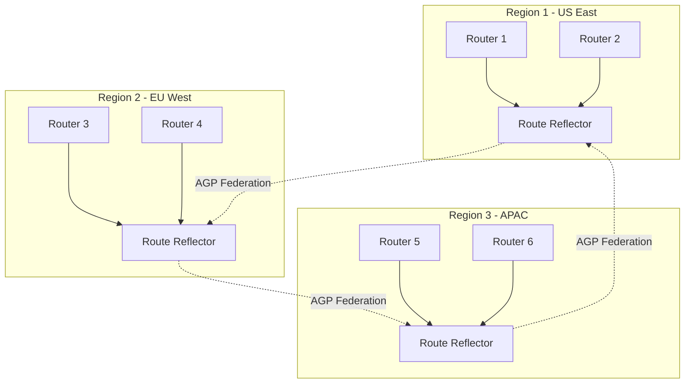

### 2. Persona-Based Adapter System

Advanced role-based AI persona management with compliance and security controls:

#### Persona Features
- **Role-Based Personas**: doctor-advisor, network-engineer, compliance-lawyer, creative-writer
- **Compliance-Bound Personas**: HIPAA, GDPR, SOX compliance filtering
- **Parallel Thinking**: Speculative, diverse, and clone parallelism modes
- **Security & Permissions**: OPA-gated tool access with least-privilege principles
- **SPIFFE/SPIRE Integration**: Service identity and mTLS for adapter communication

#### Persona Lifecycle States
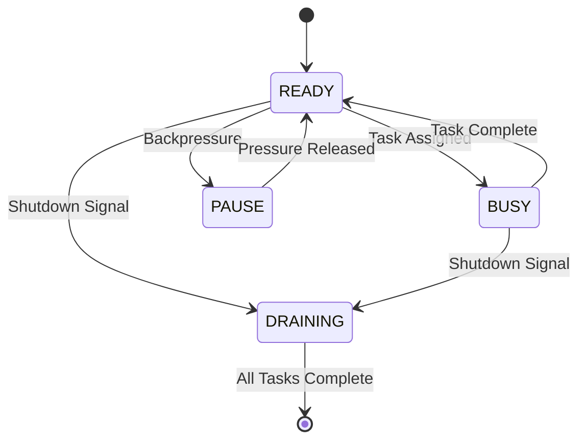

### 3. Memory and Context Fabric

Sophisticated shared memory system with multiple consistency levels and storage backends:

#### Memory Fabric Features
- **Multi-Backend Support**: Redis, PostgreSQL, Weaviate vector store
- **Consistency Levels**: EVENTUAL (default) and READ_YOUR_WRITES for same-session flows
- **Namespace Management**: tenant/project/session hierarchical organization
- **Access Control**: OPA-based permissions with row-level encryption
- **Schema Evolution**: Versioned schemas with migration support

#### Memory Architecture
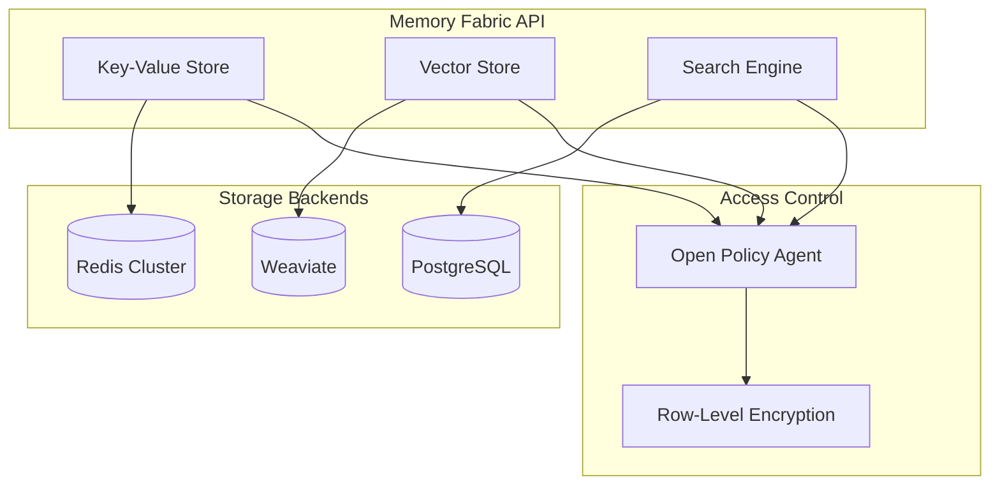

### 4. Advanced Backpressure and Flow Control

Comprehensive flow control system with QoS tiers and intelligent backpressure:

#### Flow Control Features
- **Triplet Windows**: max_parallel, max_tokens, max_usd_micros per stream
- **QoS Tiers**: Gold > Silver > Bronze with preemption support
- **AIMD Controllers**: Additive Increase / Multiplicative Decrease for window tuning
- **ECN Marking**: Explicit Congestion Notification for upstream rate control
- **Watermark Backpressure**: Queue depth monitoring with high/low watermarks

### 5. Model Context Protocol (MCP) Integration

Standardized tool discovery and invocation with streaming support:

#### MCP Features
- **Dynamic Tool Generation**: Auto-generated tool descriptors from adapter registry
- **Streaming Partial Outputs**: Real-time token streaming with sequence tracking
- **Champion/Challenger Metadata**: Experiment information in streaming responses
- **WebSocket Transport**: Full-duplex communication with heartbeat support

### 6. Small Language Model (SLM) First Strategy

Comprehensive SLM optimization pipeline with federated learning:

#### SLM Features
- **Task Clustering Pipeline**: TF-IDF + embedding-based clustering for specialist selection
- **PEFT Fine-Tuning**: LoRA adapters for rapid model specialization
- **Adaptive Router Autonomy**: UCB scoring with shadow evaluation and promotion/demotion
- **Model Registry**: Comprehensive model catalog with safety grades and lifecycle management
- **Provenance Logging**: Tamper-evident audit trails for model operations

### 7. Sustainability and Carbon Awareness

Advanced environmental impact tracking and carbon-aware routing:

#### Sustainability Features
- **Energy Attribution**: Per-request energy consumption tracking (kWh)
- **CO2e Emissions**: Regional carbon intensity integration
- **Carbon-Aware Routing**: Route to lower-carbon regions when possible
- **Efficiency Metrics**: Energy savings tracking and reporting
- **Regional Optimization**: Dynamic routing based on grid carbon intensity

### 8. Federated Learning and Secure Aggregation

Privacy-preserving collaborative learning across router nodes:

#### Federated Learning Features
- **Secure Multi-Party Computation**: HMAC-based signatures with encryption
- **Differential Privacy**: Noise injection for privacy preservation
- **Homomorphic Encryption**: Computation on encrypted statistics
- **Reinforcement Prior Updates**: Bayesian prior updates from federated signals
- **Byzantine Fault Tolerance**: Resilience against malicious participants

### 9. Advanced Analytics and Gain-Share Billing

Comprehensive cost analytics with revenue-sharing capabilities:

#### Analytics Features
- **Baseline Frontier Models**: Historical cost comparison repository
- **Realized Savings Computation**: Actual vs. baseline cost tracking
- **Gain-Share Billing**: Revenue-sharing based on achieved savings
- **ROI Reporting**: Detailed value demonstration for enterprise customers
- **Multi-Objective Scoring**: Cost, latency, quality, carbon optimization

### 10. Predictive Prewarming and Edge Optimization

Intelligent resource prewarming based on demand prediction:

#### Prewarming Features
- **Pattern Analysis**: Time-of-day and inter-arrival time analysis
- **Demand Prediction**: 5-minute ahead prediction with median-based algorithms
- **Resource Prewarming**: Proactive SLM model warming before demand spikes
- **Hit Rate Tracking**: Performance metrics for prewarming effectiveness
- **Edge Optimization**: Distributed edge nodes with intelligent caching

### 11. Comprehensive Security and Compliance Framework

Enterprise-grade security with multiple compliance standards:

#### Security Features
- **SPIFFE/SPIRE Identity**: Zero-trust service identity framework
- **Frame Signatures**: HMAC-SHA256 signatures for message integrity
- **Anti-Replay Protection**: Nonce-based replay attack prevention
- **Data Scope Enforcement**: Granular data classification and access control
- **Secret Egress Guard**: Detection and blocking of credential leakage
- **WAF Integration**: OWASP Core Rules with prompt injection protection

### 12. Adapter Certification and Marketplace

Comprehensive adapter ecosystem with certification and marketplace:

#### Certification Features
- **Multi-Level Certification**: Basic, Performance, and Enterprise levels
- **Automated Testing**: Comprehensive test suites with performance validation
- **Security Scanning**: Vulnerability assessment and compliance checking
- **Marketplace Integration**: Revenue sharing and usage-based billing
- **Conformance Testing**: Standardized compatibility validation

### 13. Observability and Monitoring Excellence

Advanced observability with comprehensive metrics and tracing:

#### Observability Features
- **Fair Queue Scheduler**: Starvation-aware scheduling with detailed tracing
- **End-to-End Tracing**: Distributed tracing across all service interactions
- **Custom Metrics Catalog**: Comprehensive Prometheus metrics with cardinality controls
- **Adaptive Sampling**: Dynamic trace sampling based on error budgets
- **Real-Time Dashboards**: Grafana dashboards with automated alerting

## Enterprise Integration Patterns

### 1. Multi-Tenant Architecture

The platform provides comprehensive multi-tenancy with isolation and resource management:

```typescript
interface TenantConfiguration {
  tenantId: string
  resourceLimits: {
    maxConcurrentRequests: number
    maxTokensPerMinute: number
    maxCostPerHour: number
  }
  complianceProfile: {
    dataClassifications: string[]
    retentionPolicies: RetentionPolicy[]
    auditRequirements: AuditRequirement[]
  }
  routingPreferences: {
    preferredRegions: string[]
    carbonAwareness: boolean
    costOptimization: 'aggressive' | 'balanced' | 'quality-first'
  }
}
```

### 2. Enterprise SSO Integration

Seamless integration with enterprise identity providers:

```yaml
# OIDC Configuration
oidc:
  providers:
    - name: "corporate-azure-ad"
      issuer: "https://login.microsoftonline.com/tenant-id/v2.0"
      client_id: "${AZURE_CLIENT_ID}"
      client_secret: "${AZURE_CLIENT_SECRET}"
      scopes: ["openid", "profile", "email"]
    
    - name: "okta-enterprise"
      issuer: "https://company.okta.com"
      client_id: "${OKTA_CLIENT_ID}"
      client_secret: "${OKTA_CLIENT_SECRET}"
      
  role_mapping:
    "atp-admin": ["system:admin", "policies:write", "users:manage"]
    "atp-user": ["requests:submit", "metrics:read"]
    "atp-auditor": ["audit:read", "compliance:read"]
```

### 3. API Gateway Integration

Enterprise API management with rate limiting and analytics:

```yaml
# API Gateway Configuration
api_gateway:
  rate_limiting:
    - path: "/v1/ask"
      limits:
        - tier: "free"
          requests_per_minute: 100
        - tier: "premium"
          requests_per_minute: 10000
        - tier: "enterprise"
          requests_per_minute: 100000
  
  analytics:
    enabled: true
    retention_days: 90
    export_formats: ["prometheus", "datadog", "newrelic"]
  
  transformation:
    request_enrichment: true
    response_filtering: true
    pii_redaction: true
```

## Deployment Automation and Infrastructure

### 1. Infrastructure as Code

Comprehensive Terraform modules for all supported cloud providers:

```hcl
# Terraform Module Structure
module "atp_platform" {
  source = "./modules/atp-platform"
  
  # Cloud Provider Configuration
  cloud_provider = "gcp"  # aws, azure, gcp
  region = "us-central1"
  
  # Scaling Configuration
  min_replicas = 3
  max_replicas = 100
  auto_scaling_enabled = true
  
  # Security Configuration
  enable_mtls = true
  enable_waf = true
  certificate_authority = "lets-encrypt"
  
  # Monitoring Configuration
  monitoring_stack = "prometheus-grafana"
  log_aggregation = "elasticsearch"
  tracing_backend = "jaeger"
  
  # Compliance Configuration
  compliance_profiles = ["soc2", "gdpr", "hipaa"]
  audit_retention_years = 7
  
  # Cost Optimization
  enable_spot_instances = true
  enable_preemptible_nodes = true
  cost_optimization_level = "aggressive"
}
```

### 2. Kubernetes Operators

Custom operators for automated platform management:

```yaml
# ATP Platform Operator
apiVersion: atp.platform/v1
kind: ATPCluster
metadata:
  name: production-cluster
spec:
  version: "1.0.0"
  
  router:
    replicas: 5
    resources:
      requests:
        cpu: "2"
        memory: "4Gi"
      limits:
        cpu: "4"
        memory: "8Gi"
  
  adapters:
    - name: "openai-adapter"
      replicas: 3
      model_types: ["gpt-4", "gpt-3.5-turbo"]
    
    - name: "anthropic-adapter"
      replicas: 2
      model_types: ["claude-3", "claude-2"]
  
  federation:
    enabled: true
    regions: ["us-east", "eu-west", "asia-southeast"]
    
  compliance:
    profiles: ["enterprise"]
    audit_enabled: true
    pii_redaction: true
```

### 3. GitOps Deployment Pipeline

Automated deployment with comprehensive validation:

```yaml
# GitHub Actions Workflow
name: ATP Platform Deployment
on:
  push:
    branches: [main]
    paths: ['platform/**']

jobs:
  validate:
    runs-on: ubuntu-latest
    steps:
      - name: Validate Configuration
        run: |
          terraform validate
          helm lint charts/
          kubectl apply --dry-run=client -f manifests/
  
  security-scan:
    runs-on: ubuntu-latest
    steps:
      - name: Security Scanning
        run: |
          trivy fs --security-checks vuln,config .
          checkov -d terraform/
          kubesec scan manifests/
  
  deploy-staging:
    needs: [validate, security-scan]
    runs-on: ubuntu-latest
    steps:
      - name: Deploy to Staging
        run: |
          terraform apply -var-file=staging.tfvars
          helm upgrade --install atp-staging charts/atp
  
  integration-tests:
    needs: deploy-staging
    runs-on: ubuntu-latest
    steps:
      - name: Run Integration Tests
        run: |
          pytest tests/integration/ --staging
          k6 run tests/performance/load-test.js
  
  deploy-production:
    needs: integration-tests
    runs-on: ubuntu-latest
    if: github.ref == 'refs/heads/main'
    steps:
      - name: Deploy to Production
        run: |
          terraform apply -var-file=production.tfvars
          helm upgrade --install atp-production charts/atp
```

This comprehensive design now includes all the advanced features discovered in the documentation, providing a complete enterprise-grade AI platform specification that addresses routing optimization, compliance, security, observability, and operational excellence.