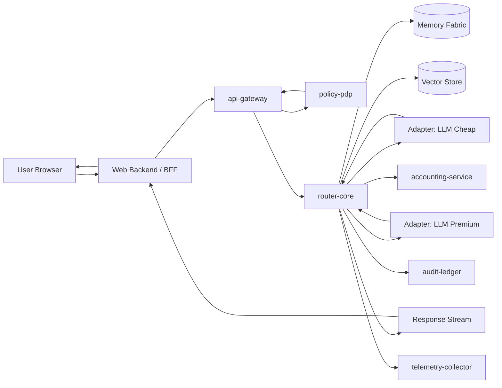
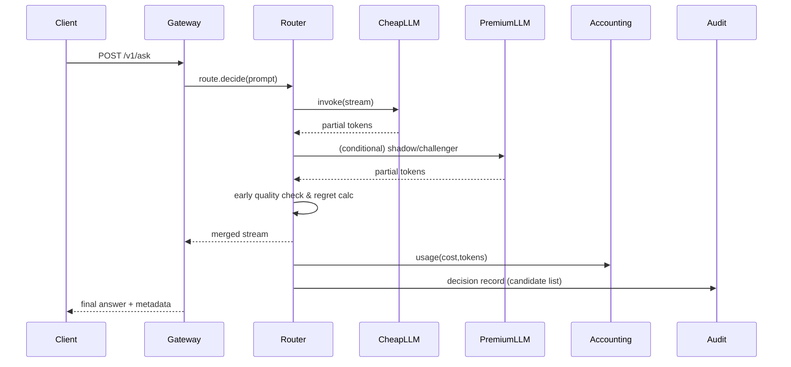
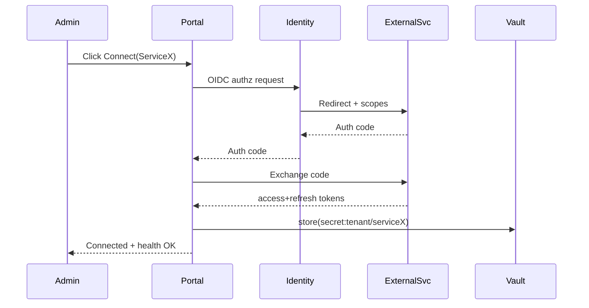
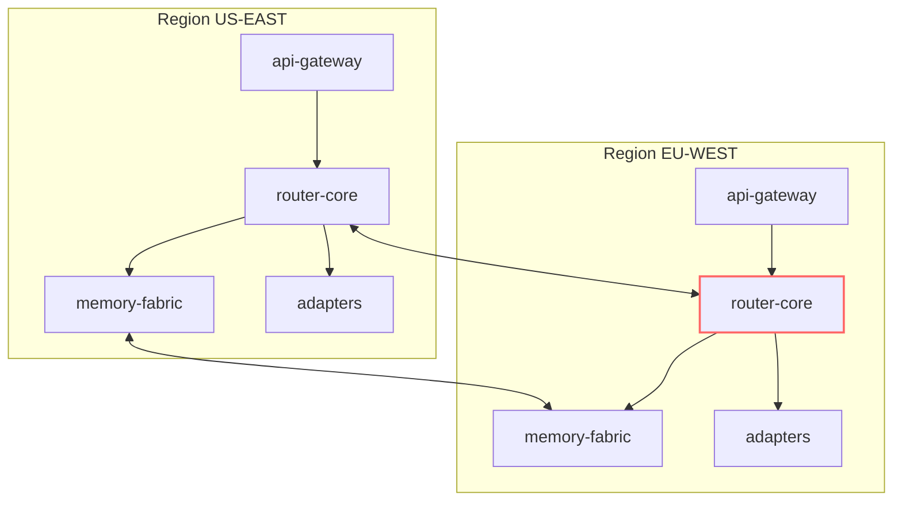
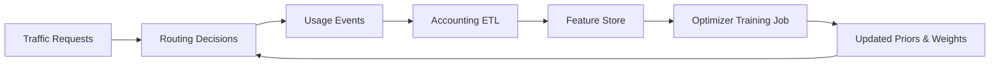
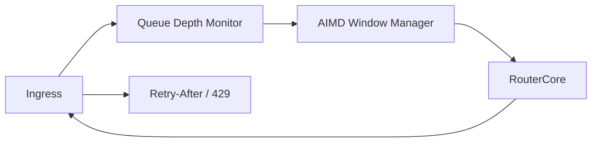
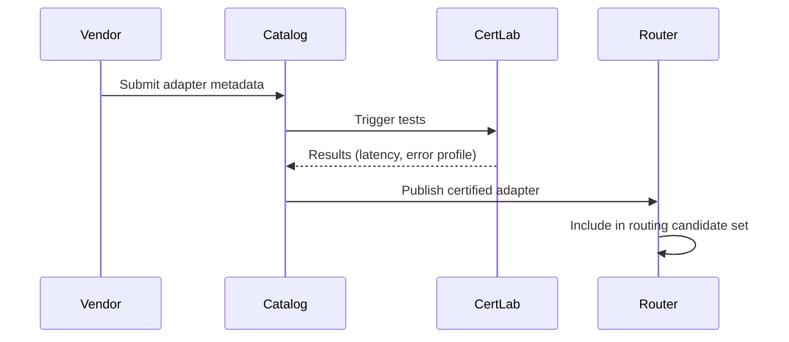

# 29 — Full Platform Blueprint (Massive Reference)

> Master systems view: components, flows, boundaries, and evolution paths. Use this as the canonical architecture map.

---
## 1. Layered Architecture (Conceptual Stack)
```
+--------------------------------------------------------------------------------------+
| EXPERIENCE LAYER                                                                      |
|  - Web Portal (Admin, Dashboards)  - Chat UI / Agent UX  - Public APIs / MCP Endpoint |
+--------------------------------------------------------------------------------------+
| AGENT & ORCHESTRATION LAYER                                                           |
|  - Planner / Strategy Selector  - Tool Registry  - Conversation Memory Abstraction    |
|  - Retrieval Orchestrator  - Cost Guard / Budget Enforcer                             |
+--------------------------------------------------------------------------------------+
| CONTROL PLANE (ATP CORE)                                                              |
|  - Ingress Gateway (Auth, Rate, Redaction)  - Policy PDP / ABAC / Tool Permissions    |
|  - Routing Engine (Bandits, Multi-Objective, Speculative, Champion/Challenger)        |
|  - Experiment Manager  - Federation Coordinator  - Backpressure & QoS Scheduler       |
+--------------------------------------------------------------------------------------+
| DATA & CONTEXT FABRIC                                                                 |
|  - KV Store (Session Windows)  - Vector Store  - CRDT Shared Memory  - Feature Store  |
|  - Document/Artifact Store (Object)                                                   |
+--------------------------------------------------------------------------------------+
| OBSERVABILITY & GOVERNANCE                                                            |
|  - Metrics/Tracing (OTEL)  - Audit Hash Chain  - DP Budget Ledger  - Cost & Billing   |
|  - Compliance Evidence Generator  - Drift / Anomaly Detectors                         |
+--------------------------------------------------------------------------------------+
| ADAPTER / INTEGRATION LAYER                                                           |
|  - Model Adapters (LLMs, Embedders)  - Tool Adapters (Slack, Jira, Drive)             |
|  - Retrieval Connectors  - Notification / Ticketing  - Marketplace Catalog            |
+--------------------------------------------------------------------------------------+
| PLATFORM FOUNDATIONS                                                                  |
|  - Secrets / Vault  - Identity (OIDC, mTLS SPIFFE)  - Service Mesh  - Storage (SQL)   |
|  - Event Bus (Kafka/NATS)  - Object Store  - Queue (Work, DLQ)  - CI/CD Pipeline       |
+--------------------------------------------------------------------------------------+
| INFRASTRUCTURE                                                                        |
|  - Kubernetes / Multi-Region Clusters  - Edge Nodes  - CDN / WAF  - Terraform / Helm  |
+--------------------------------------------------------------------------------------+
```

---
## 2. Core Services Inventory
| Domain | Service | Key Interfaces | Scaling Axis |
|--------|---------|---------------|--------------|
| Ingress | api-gateway | REST/WebSocket/MCP | Requests/sec |
| AuthN/Z | identity-broker | OIDC callbacks, token introspect | Users, tenants |
| Policy | policy-pdp | `/policy/check` gRPC/HTTP | Policy eval latency |
| Routing | router-core | `/route/decide` internal RPC | Decision QPS |
| Experiments | experiment-controller | `/experiment/report` | Number of experiments |
| Federation | federation-coordinator | gossip delta pub/sub | Cluster count |
| Memory | memory-fabric | `/memory/*` | Sessions, vector ops |
| Adapters | adapter-runtime-* | Uniform adapter RPC | Model/tool calls |
| Cost | accounting-service | ingestion topic → reporting | Events/sec |
| Audit | audit-ledger | append-only API | Entry/sec |
| DP | dp-ledger | epsilon check API | Protected metrics |
| Optimizer | cost-quality-optimizer | batch training jobs | Feature size |
| Marketplace | catalog-service | adapter metadata APIs | Listings |
| Observability | telemetry-collector | OTLP ingest | Spans/metrics/sec |
| Compliance | evidence-pack-svc | report generation | Report jobs |

---
## 3. High-Level Data Flow (User Query)


---
## 4. Sequence: Champion/Challenger Escalation


---
## 5. Sequence: Add OAuth Integration


---
## 6. Multi-Region Topology (Active/Active)

Federation deltas: signed, smoothed by drift damping.

---
## 7. Security Boundary Diagram
```
[Public Internet]
    |
    v
+-----------+      +------------------+
|  WAF/CDN  |----->|  API Gateway     |-- mTLS --> Internal Mesh
+-----------+      +------------------+
                        | (JWT → SPIFFE)
                        v
                +------------------+
                | Policy PDP       |
                +------------------+
                        |
                        v
                +------------------+    +------------------+
                | Router Core      |<-->| Adapter Runtime  |
                +------------------+    +------------------+
                        |
                        v
                +------------------+
                | Memory / Stores  |
                +------------------+
                        |
                        v
                +------------------+
                | Audit / Ledger   |
                +------------------+
```

---
## 8. Cost Optimization Feedback Loop


---
## 9. Multi-Objective Scoring (Logical)
```
Inputs: latency_pred, cost_pred, quality_pred, risk_score
Normalize → Weighted sum or Pareto filter → shortlist → exploration heuristic (epsilon/Thompson) → final pick
```
Equation (example):
```
score = w_cost * cost_norm + w_latency * latency_norm - w_quality * quality_norm + w_risk * risk_norm
```
Adapt weights dynamically per tenant plan & user-selected quality tier.

---
## 10. Data Storage Mapping
| Data | Store | Retention | Notes |
|------|-------|-----------|------|
| Conversations | Postgres | 30-400d (tiered) | RLS per tenant |
| Session windows | Redis + snapshot | Hours → days | Hot context |
| Embeddings | Vector DB | Configurable | Multi-region replication |
| Audit log | Append PG / Obj Store | Years (cold) | Hash chained |
| DP budgets | Postgres | Active window | Strict integrity |
| Usage cost events | Kafka → Columnar | 400d | Rollups per hour |
| Model metrics | TSDB (Prometheus/Mimir) | 30-180d | Downsampled |

---
## 11. Backpressure & QoS Control Path

Priorities (gold/silver/bronze) map to different concurrency pools.

---
## 12. Experiment Lifecycle State Machine
```
REGISTERED -> (traffic allocation start) -> SHADOWING
SHADOWING -> (guardrails pass + min traffic) -> CHALLENGING
CHALLENGING -> (stat confidence) -> PROMOTED
CHALLENGING -> (quality or latency fail) -> ROLLED_BACK
PROMOTED -> (new challenger) -> HISTORIC
```

---
## 13. Marketplace Flow

Monetization: usage metering tags per adapter.

---
## 14. Observability Signals Map
| Span | Key Attributes | Derived Metrics |
|------|----------------|-----------------|
| ingress.request | tenant, route_id, qos | request_rate, p95_latency |
| policy.check | policy_ids, decision | deny_rate |
| route.decision | candidate_set, chosen, exploration | regret_estimate, savings_pct |
| adapter.call | model, tokens_in/out, status | error_rate, tokens_per_sec |
| memory.op | op_type, latency | memory_latency_p95 |
| audit.append | hash_prev, size | audit_lag |
| dp.consume | metric_id, epsilon_delta | dp_budget_remaining |

---
## 15. Engineering Deployment Pipeline
```mermaid
graph LR
DevCommit --> CI[CI: lint/test/fuzz]
CI --> SecScan[Security & SBOM]
SecScan --> Build[Image Build + Sign]
Build --> StagingDeploy[Staging Deploy]
StagingDeploy --> Tests[Smoke + Load + Chaos]
Tests --> Canary[Prod Canary 10%]
Canary --> Progressive[50% -> 100%]
Progressive --> Monitor[SLO Burn Watch]
Monitor --> (Rollback?)
```

---
## 16. Edge Routing Option (Future)
```
User -> Edge Node (tiny model / prompt compression) -> Core Router -> Adapters
Edge Node caches: embeddings, small distilled model. Falls back quickly when SLO risk.
```

---
## 17. Tenancy & Policy Resolution
```
JWT Claims -> Identity Broker -> Tenant Profile (plan, quotas, policy refs)
Request Attributes + Tenant Policy + Integration Scopes -> Policy PDP decision
Decision attaches: allowed_tools[], redaction_profile, retention_policy
```

---
## 18. Savings Attribution Model
```
Baseline Cost: tokens * premium_cost_rate
Actual Cost: Σ(route_cost)
Savings % = (Baseline - Actual)/Baseline * 100
Store per turn -> roll up daily -> dashboard & gain-share billing
```

---
## 19. Risk / Anomaly Loops
| Signal | Detector | Mitigation |
|--------|----------|------------|
| Latency spike | p95 > threshold | Auto-escalate to faster model class |
| Cost spike | spend/hour > forecast | Throttle low-priority experiments |
| Quality drift | regret ↑ | Recompute priors / retrain ranking |
| DP near exhaustion | epsilon_remaining <10% | Alert + disable optional metrics |
| Policy denial spike | deny_rate ↑ | Freeze related config rollout |

---
## 20. Capability Maturity Overlay
| Phase | Newly Activated Components |
|-------|-----------------------------|
| Foundation | Ingress, Router, Memory, Adapters, Basic Metrics |
| Governance | Policy PDP, Audit Ledger, DP Ledger, Redaction Engine |
| Optimization | Optimizer, Experiment Controller, Multi-Objective Scoring |
| Scale | Federation, Backpressure Scheduler, Marketplace Catalog |
| Advanced | Edge Nodes, Predictive Prewarming, Evidence Packs |

---
## 21. Extensibility Points
| Hook | Mechanism |
|------|----------|
| Add Model Adapter | Register metadata + pass conformance tests |
| Add Policy Type | Policy DSL plugin (PDP evaluation module) |
| Add Optimization Strategy | Strategy interface in router-core (exploration policy) |
| Add Observability Dimension | OTEL semantic conv + derived metric rule |
| Add Tool to Agent | Tool registry entry + permission scope |

---
## 22. Roadmap Visual (Simplified Gantt Blocks)
```
Q1: [Foundation==================]
Q2:        [Governance===========]
Q3:                    [Optimization============]
Q4:                               [Scale========]
Q5:                                        [Advanced====]
```

---
## 23. Future Experimental Tracks
- Federated Reinforcement Signals (cross-tenant priors) with strict privacy.
- Adaptive Tail Sampling tuned by per-tenant error budgets.
- Zero-copy streaming frames over QUIC multiplexed flows.
- Hardware acceleration (token gating nets on edge GPU/TPU micro-batches).

---
## 24. Single-Page Narrative (Executive Summary)
"ATP unifies multi-model routing, governance, and cost intelligence into a programmable control plane. Requests enter through a secured ingress, get shaped by policy and redaction, and are routed using multi-objective bandit strategies to the cheapest acceptable providers. The system continuously learns from cost, latency, and quality feedback loops while maintaining strict privacy guarantees (DP ledger) and tamper-evident audit trails. Federation extends this across regions, and an agent layer plus marketplace accelerate adoption and ecosystem growth." 

---
## 25. Quick Legend (Diagram Symbols)
| Symbol | Meaning |
|--------|---------|
| Rounded Box | Stateful logical service |
| Circle (O) | Data store / topic |
| Double Box | External integration |
| Dashed Line | Optional / future component |
| Red Outline | Federated sync path |

---
## 26. Next Artifacts To Produce
- JSON Schemas for router API & tool descriptors.
- Terraform baseline module diagrams.
- Threat model (STRIDE table) document.
- SLO & error budget policy doc.

---
## 27. How To Use This Blueprint
- Architecture reviews: trace a request path end-to-end.
- Onboarding: highlight which components are *real* vs *planned*.
- Roadmap: map open Jira/Epics to sections above.
- Pre-sales: tailor slice (e.g., Governance + Optimization) as curated diagram.

---
End of Blueprint.
