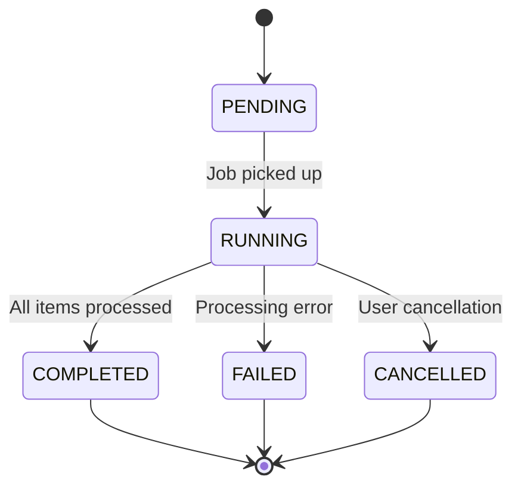

# GAP-309: Vector Backfill & Re-embedding Pipeline

## Overview

The vector backfill and re-embedding pipeline provides automated orchestration for re-embedding vector data when embedding models change. This ensures data consistency and quality across model version upgrades.

## Architecture

### Core Components

1. **ReembedJobOrchestrator**: Main orchestration service
2. **ReembedJob**: Job definition and state tracking
3. **ReembedBatch**: Batch processing unit for efficient re-embedding
4. **Metrics Integration**: Comprehensive monitoring and alerting

### Job Lifecycle



## Usage

### Starting the Orchestrator

```python
from tools.reembed_orchestrator import initialize_reembed_orchestrator

# Initialize with dependencies
orchestrator = initialize_reembed_orchestrator(
    vector_backend=vector_backend,
    embedding_service=embedding_service,
    max_concurrent_jobs=3,
    batch_size=100
)

# Start processing
await orchestrator.start()
```

### Submitting Jobs

```python
job_id = await orchestrator.submit_job(
    namespace="production",
    source_model="text-embedding-ada-002",
    target_model="text-embedding-3-small",
    priority="high"
)
```

### Monitoring Jobs

```python
# Get job status
job = orchestrator.get_job_status(job_id)

# List all jobs
jobs = orchestrator.list_jobs()

# Get metrics
metrics = orchestrator.get_metrics()
```

### Cancelling Jobs

```python
success = await orchestrator.cancel_job(job_id)
```

## Configuration

### Environment Variables

- `MAX_CONCURRENT_REEMBED_JOBS`: Maximum concurrent jobs (default: 3)
- `REEMBED_BATCH_SIZE`: Items per batch (default: 100)
- `REEMBED_JOB_TIMEOUT_SECONDS`: Job timeout (default: 3600)

### Priority Levels

- `LOW`: Background processing
- `MEDIUM`: Standard priority
- `HIGH`: Important updates
- `CRITICAL`: Emergency re-embedding

## Metrics

The orchestrator exposes the following metrics:

- `reembed_jobs_completed_total`: Total completed jobs
- `reembed_jobs_failed_total`: Total failed jobs
- `reembed_jobs_active`: Currently active jobs
- `reembed_jobs_queued`: Jobs waiting in queue
- `reembed_batches_processed_total`: Total batches processed
- `reembed_items_reembedded_total`: Total items re-embedded

## Error Handling

### Common Failure Scenarios

1. **Vector Backend Unavailable**: Job fails with connection error
2. **Embedding Service Timeout**: Batch processing fails
3. **Invalid Model Version**: Source/target model validation fails
4. **Resource Exhaustion**: Memory/disk space issues

### Recovery Mechanisms

- Automatic retry with exponential backoff
- Partial batch recovery
- Job state persistence for restart
- Comprehensive error logging

## Performance Considerations

### Optimization Strategies

1. **Batch Processing**: Process items in configurable batches
2. **Concurrent Execution**: Multiple jobs run simultaneously
3. **Resource Limits**: Configurable concurrency and batch sizes
4. **Progress Tracking**: Real-time progress monitoring

### Scaling Guidelines

- **Small Deployments**: 1-2 concurrent jobs, batch size 50-100
- **Medium Deployments**: 3-5 concurrent jobs, batch size 100-500
- **Large Deployments**: 5+ concurrent jobs, batch size 500-1000

## Integration Points

### Vector Backend Interface

The orchestrator integrates with any vector backend implementing:

```python
class VectorBackend:
    async def health_check(self) -> bool: ...
    async def get_namespace_items(self, namespace: str) -> list[dict]: ...
    async def upsert_vectors(self, namespace: str, vectors: list[dict]) -> None: ...
```

### Embedding Service Interface

```python
class EmbeddingService:
    async def generate_embedding(self, text: str, model: str) -> list[float]: ...
    async def get_model_info(self, model: str) -> dict: ...
```

## Security Considerations

### Access Control

- Namespace-scoped job execution
- Model version validation
- Audit logging for all operations

### Data Protection

- No plaintext storage of sensitive data
- Secure communication with embedding services
- Tamper-evident audit trails

## Monitoring & Alerting

### Key Alerts

1. **High Failure Rate**: `reembed_jobs_failed_total / reembed_jobs_completed_total > 0.1`
2. **Queue Backlog**: `reembed_jobs_queued > threshold`
3. **Slow Processing**: Job duration exceeds expected time

### Dashboard Panels

- Job completion rates over time
- Queue depth and processing latency
- Batch processing efficiency
- Error rates by namespace/model

## Troubleshooting

### Common Issues

1. **Jobs Stuck in PENDING**: Check orchestrator startup and queue processing
2. **High Error Rates**: Verify embedding service connectivity and model availability
3. **Slow Performance**: Adjust batch size and concurrency settings

### Debug Commands

```bash
# Check orchestrator status
curl http://localhost:8000/metrics | grep reembed

# View job logs
tail -f /var/log/reembed_orchestrator.log

# Manual job cancellation
curl -X POST http://localhost:8000/jobs/{job_id}/cancel
```

## Future Enhancements

### Planned Features

1. **Incremental Re-embedding**: Only re-embed changed items
2. **Model Version Auto-Detection**: Automatic job creation on model updates
3. **Quality Validation**: Post-re-embedding quality checks
4. **Rollback Support**: Revert to previous embeddings on failure
5. **Multi-Region Support**: Cross-region re-embedding coordination

### API Extensions

- REST API for job management
- Webhook notifications for job completion
- Streaming progress updates
- Bulk job operations
