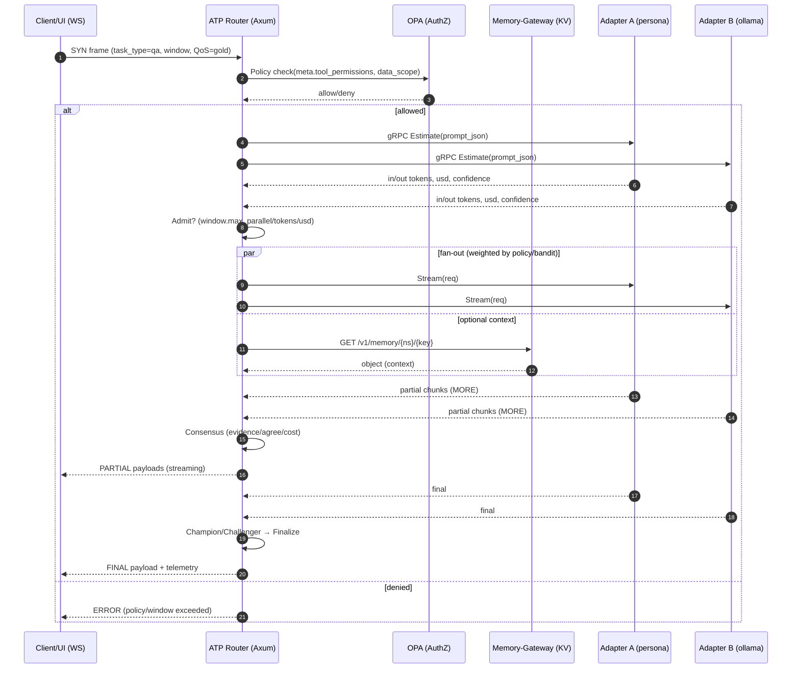
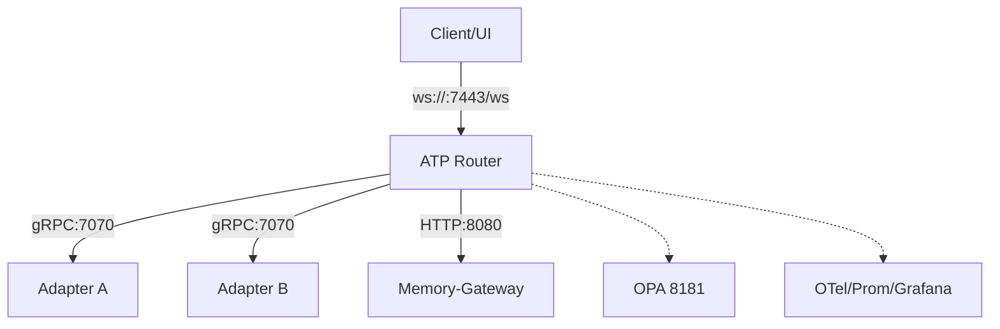
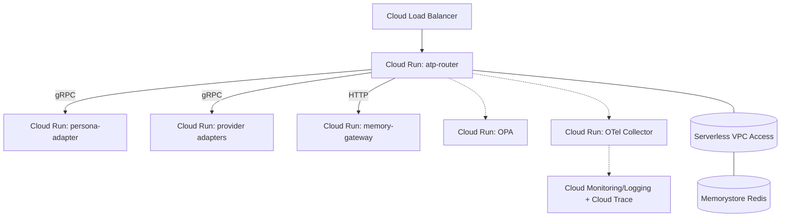

# ATP Flow Diagram

## 1) End-to-End Sequence


## 2) Components & Ports


- Router: `:7443` (WS/HTTP), env: `ADAPTER_ENDPOINTS`, `MEMORY_GATEWAY_URL`, `OPA_URL`.
- Adapters: `:7070` gRPC (`Estimate/Stream/Health`).
- Memory: `:8080` KV API. OTel/Prom/Grafana via docker-compose.

## 3) Example Frames
SYN (open stream):
```json
{
  "v":1,
  "session_id":"s1",
  "stream_id":"st1",
  "msg_seq":1,
  "frag_seq":0,
  "flags":["SYN"],
  "qos":"gold",
  "ttl":8,
  "window": {"max_parallel":4, "max_tokens":50000, "max_usd_micros":1000000},
  "meta": {"task_type":"qa", "tool_permissions":[], "data_scope":["no_secrets"]},
  "payload": {"type":"agent.result.partial", "content":{"prompt":"hello"}}
}
```
PARTIAL (router streams progress back):
```json
{
  "v":1, "session_id":"s1", "stream_id":"st1",
  "msg_seq":2, "frag_seq":0, "flags":["MORE"],
  "payload": {"type":"agent.result.partial","content":{"chunk":0,"adapter":"persona_adapter"}, "confidence":0.62}
}
```
FINAL (after consensus):
```json
{
  "v":1, "session_id":"s1", "stream_id":"st1",
  "msg_seq":3, "flags":["FIN"],
  "payload": {"type":"agent.result.final","content":{"ok":true,"answer":"..."}},
  "telemetry": {"tokens": 48210, "usd": 910000, "latency_ms": 1320}
}
```

## 4) Notes on Flow Control & QoS
- Admission: Router rejects or backpressures when `window` would be exceeded.
- QoS: Gold/Silver/Bronze lanes with fair-queue scheduler and Bronze shedding under pressure.
- Escalation: Champion/Challenger or quorum strategies trigger higher-tier adapters on low confidence or disagreement.
- Memory: Optional GET/PUT to enrich prompts or store results; namespace `tenant/project/session`.

## 5) Minimal Local Test
- Bring up stack: `docker compose up --build`
- Send a frame: `python client/ws_client_stub.py`
- Observe: `make test` runs ws/memory/adapters health checks.

## 6) Why It’s Faster & Smarter
- Preflight Estimates: Router asks adapters for token/$ estimates and denies work that would overflow context or budget before fanout.
- Windows & QoS: Sliding windows (parallel/tokens/usd) + fair-queue lanes protect p95 and prevent head-of-line blocking under load.
- Cheap-First Escalation: Route to fast/cheap experts first; escalate to bigger models only on low confidence or disagreement.
- Consensus & Verification: Evidence-/agreement-weighted consolidation (and optional verifier models) reduces hallucinations.
- Shared Memory: Reuse prior findings/context to cut tokens and latency; store results for downstream steps.
- Streaming Control: Partial results with backpressure; WINDOW_UPDATE adjusts mid-flight to avoid overruns.

## 7) Frontend → Backend Example
1. Frontend (e.g., Next.js) opens `WebSocket` to `wss://router.example.com/ws` and sends a SYN frame with `task_type=code_review`, `window.max_tokens=50k`.
2. Router validates OIDC token, checks OPA policy, and optionally fetches repo context from memory (`/v1/memory/...`).
3. Router requests `Estimate` from candidate adapters (small local model + large cloud model). If sum(est_tokens) > window, it clips or declines.
4. Bandit/Gating picks small model first (fast), keeps large model on deck; both stream if policy allows fanout.
5. Router streams PARTIALs to frontend; if confidence low or disagreement high, it escalates (champion/challenger).
6. Router emits FINAL with telemetry (tokens/usd/latency) and stores artifacts in memory for follow-ups.

Minimal client pseudo-code:
```js
const ws = new WebSocket('wss://router.example.com/ws');
ws.onopen = () => ws.send(JSON.stringify(frame));
ws.onmessage = (e) => render(JSON.parse(e.data));
```

## 8) Google Cloud Example (Reference)


Artifacts & deploy (example):
```bash
gcloud artifacts repositories create atp --repository-format=docker --location=us-central1

# Build & push (router as example)
gcloud builds submit atp-router \
  --tag us-central1-docker.pkg.dev/$PROJECT/atp/atp-router:v1

# Deploy router to Cloud Run (WebSocket enabled)
gcloud run deploy atp-router \
  --image us-central1-docker.pkg.dev/$PROJECT/atp/atp-router:v1 \
  --platform managed --region us-central1 \
  --allow-unauthenticated \
  --port 7443 \
  --set-env-vars "RUST_LOG=info,atp_router=debug" \
  --set-env-vars "ADAPTER_ENDPOINTS=[\"http://persona-adapter:7070\",\"http://provider-adapter:7070\"]" \
  --set-env-vars "MEMORY_GATEWAY_URL=http://memory-gateway:8080" \
  --set-env-vars "OPA_URL=http://opa:8181" \
  --ingress all

# Deploy adapters/memory/OPA similarly
gcloud run deploy persona-adapter --image us-central1-docker.pkg.dev/$PROJECT/atp/persona-adapter:v1 --port 7070
gcloud run deploy memory-gateway  --image us-central1-docker.pkg.dev/$PROJECT/atp/memory-gateway:v1 --port 8080
gcloud run deploy opa              --image openpolicyagent/opa:0.63.0-rootless --port 8181 \
  --args "run","--server","--addr=0.0.0.0:8181","/policy/policy.rego"

# Optional: VPC connector + Memorystore for shared/session state
gcloud compute networks vpc-access connectors create atp-conn --region us-central1 --network default --range 10.8.0.0/28
gcloud run services update atp-router --vpc-connector atp-conn --egress-settings all-traffic
```

Notes:
- Cloud Run supports HTTP/1.1 WebSockets; use regional external HTTP(S) LB for custom domains and TLS.
- Use Secret Manager for credentials; Cloud Run service accounts for OIDC between services.
- For higher throughput/latency control, deploy on GKE with an HTTP/3/QUIC‑enabled LB and run OTel/Prom natively.
